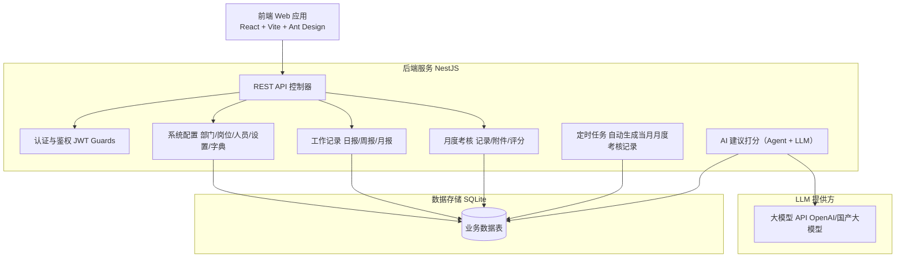
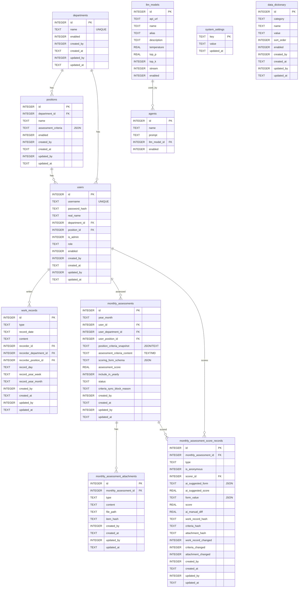

# 工作考核平台

面向开发：架构、模块与 API 约定。部署与环境变量见 [DEPLOY.md](DEPLOY.md)。

## 一、项目概述

### 1.1 目标
构建一个支持日报/周报/月报录入、AI辅助人工考核、按部门/岗位/员工标准评分的智能工作考核平台。

### 1.2 技术栈
| 层级 | 技术选型 | 说明 |
|------|----------|------|
| 后端 | **NestJS** (Node.js + TypeScript) | 模块化、依赖注入、内置守卫/管道 |
| 前端 | **React + Vite** + Ant Design | Vite 构建，支持深色/浅色主题切换 |
| 数据库 | SQLite | 单文件，易部署 |
| 认证 | JWT | 登录令牌，可配置过期时间 |
| AI 评分 | 开放 API（如 OpenAI/国产大模型） | 异步队列调用 LLM |

---

## 二、系统架构

### 2.1 整体架构图（逻辑）



### 2.2 目录结构建议

```
WorkScore/
├── backend/                      # 后端 (NestJS)
│   ├── src/
│   │   ├── app.module.ts
│   │   ├── main.ts
│   │   ├── common/               # 守卫、管道、装饰器、过滤器
│   │   ├── config/               # 配置模块（DB、JWT、LLM）
│   │   ├── auth/                 # 认证模块（登录、改密、JWT 策略）
│   │   ├── setup/                # 安装向导（首次创建管理员）
│   │   ├── departments/          # 部门模块
│   │   ├── positions/            # 岗位模块（含考核标准）
│   │   ├── users/                # 人员模块
│   │   ├── settings/             # 系统设置模块
│   │   ├── dictionaries/         # 数据字典模块
│   │   ├── work-records/         # 工作记录模块
│   │   ├── monthly-assessments/  # 月度考核记录/附件/评分模块
│   │   ├── llm-models/           # LLM 模型模块
│   │   ├── agents/               # Agent 模块
│   │   └── assessments/          # 排名与报表模块
│   ├── package.json
│   └── tsconfig.json
├── frontend/                     # 前端 (React + Vite + Ant Design)
│   ├── src/
│   │   ├── api/                  # 请求封装
│   │   ├── components/           # 通用组件
│   │   ├── theme/                # 深色/浅色主题配置与切换
│   │   ├── layouts/
│   │   ├── pages/                # 含安装向导页、登录、各业务页
│   │   ├── stores/
│   │   ├── utils/
│   │   └── App.tsx
│   ├── package.json
│   └── vite.config.ts
├── docs/
│   └── DESIGN.md
└── README.md
```

---

## 三、表结构

本节为**数据表结构与业务约束**的设计基线（SQLite 方案），用于指导后端建表、校验与后台任务实现。

### 3.1 表结构设计图（ER Diagram）



### 3.2 部门
- 数据项：主键、名称、是否启用、创建人、创建时间、更新人、更新时间。
- 约束：名称不能重复；名称、是否启用必填项。

### 3.3 岗位
- 数据项：主键、部门外键、名称、岗位考核标准、是否启用、创建人、创建时间、更新人、更新时间。
- 约束：同一部门岗位名称不能重复；部门外键、名称、岗位考核标准、是否启用必填项。
- 业务规则：岗位考核标准更新后，自动同步到**当月**月度考核记录表的"岗位考核标准内容快照"字段。
- 同步限制：只要存在任意一条**当月**月度考核记录状态为"考核中"，则不允许自动同步。
- 阻断原因：当月月度考核记录存在"考核中"状态且尝试保存岗位考核标准时，需要保存"无法在月度考核中应用"的原因（建议写入月度考核记录的 `criteria_sync_block_reason`）。

### 3.4 人员
- 数据项：主键、用户名、密码、姓名、部门外键、岗位外键、是否为 admin、角色（默认 user）、是否启用、创建人、创建时间、更新人、更新时间。
- 约束：用户名全局唯一；用户名、密码、姓名、部门外键、岗位外键、是否为 admin、角色、是否启用必填项。
- 角色：普通用户、部门负责人、系统管理员（建议枚举：`user` / `department_admin` / `system_admin`）。

### 3.5 工作记录
- 数据项：主键、类型（日报|周报|月报，默认周报）、所属日期（默认当日）、内容、记录人、记录人所属部门外键、记录人所属岗位外键、创建人、创建时间、更新人、更新时间。
- 约束：每人每天仅一条日报、每人每周仅一条周报、每人每月仅一条月报；类型、所属日期、内容、记录人必填项。
- 业务规则：当月度考核记录为**非待考核**状态时，修改工作记录给予提示。
- 变更联动：把当月周报内容做 Hash 计算，更新到对应的"月度考核评分记录表"的 `work_record_hash`，并更新"工作记录是否变更"字段值。

### 3.6 月度考核记录
- 数据项：主键、所属日期、考核人外键、考核人所属部门外键、考核人所属岗位外键、岗位考核标准内容快照、考核标准内容、考核打分项动态表单内容、考核分数、是否计入年度考核、状态（待考核、考核中、已考核）、创建人、创建时间、更新人、更新时间。
- 约束：考核人一个月仅有一条记录；所属日期、考核人外键、是否计入年度考核、状态为必填项。
- 状态说明：待考核（没有考核评分记录时为待考核）；考核中（有考核评分记录时自动更改为考核中）；已考核（进行页面操作修改）。
- 修改提示：状态为非待考核状态修改时给予提示。
- 变更联动：月度考核记录的"考核标准内容 Hash"更新到对应月度考核评分记录的 `criteria_hash`，并更新"考核标准内容是否变更"。
- 后台任务定时检查：自动创建人员月度考核记录（例如每月初为所有启用人员创建当月记录）。

### 3.7 月度考核记录附件
- 数据项：主键、月度考核记录外键、类型（任务计划、代码记录、BUG 记录、测试用例、其他）、内容、文件路径、创建人、创建时间、更新人、更新时间。
- 约束：月度考核记录外键、类型必填项；内容、文件路径不能都为空。
- 修改提示：月度考核记录状态为非待考核状态修改时给予提示。
- 变更联动：把当月附件的（类型、内容、文件路径）计算 Hash，更新到对应月度考核评分记录的 `attachment_hash`，并更新"月度考核记录附件是否变更"。

### 3.8 月度考核评分记录
- 数据项：主键、月度考核记录外键、类型（领导考核、同事考核）、是否匿名、打分人、AI 建议考核打分项动态表单、AI 建议打分分数、考核打分项动态表单、打分分数、AI 打分与人工打分差值、工作记录 Hash、月度考核记录考核标准内容 Hash、月度考核记录附件 Hash、工作记录是否变更、考核标准内容是否变更、月度考核记录附件是否变更、创建人、创建时间、更新人、更新时间。
- 约束：月度考核记录外键、类型、是否匿名、打分人、考核打分项动态表单、打分分数、AI 打分与人工打分差值、工作记录是否变更、考核标准内容是否变更、月度考核记录附件是否变更为必填项。
- 修改提示：月度考核记录状态为已考核状态时，新增、修改、删除给予提示。

### 3.9 LLM 模型
- 数据项：主键、API 地址、名称、别名、描述、Temperature、TopP、TopK、是否流式输出、是否启用。

### 3.10 Agent
- 数据项：主键、名称、提示词、LLM、是否启用。

### 3.11 系统设置
- 数据项：key、value、更新时间。
- 约束：key 唯一。
- 使用场景：人员默认角色 user；工作记录新建类型默认周报；打分权重占比（上级领导、同事）；同事打分最低人数；是否去掉最高分/最低分后算均值；每月打分截至日期；登录令牌过期时间（小时）；默认人员密码；本月工作周数。
- 本月工作周数：本月初自动更新，也可以手工调整。

### 3.12 数据字典
- 数据项：主键、类别、名称、值、顺序、是否启用、创建人、创建时间、更新人、更新时间。
- 使用场景：月度考核记录附件（任务计划、代码记录、BUG 记录、测试用例、其他）。

### 3.13 SQLite 建表建议（示例）

> 说明：以下为建议建表 SQL，用于落地约束与索引；业务规则（状态联动、Hash 计算、同步阻断原因等）主要由应用层实现。

```sql
CREATE TABLE system_settings (
  key TEXT PRIMARY KEY,
  value TEXT NOT NULL,
  updated_at TEXT
);

CREATE TABLE departments (
  id INTEGER PRIMARY KEY AUTOINCREMENT,
  name TEXT NOT NULL,
  enabled INTEGER NOT NULL DEFAULT 1,
  created_by INTEGER,
  created_at TEXT,
  updated_by INTEGER,
  updated_at TEXT
);
CREATE UNIQUE INDEX idx_departments_name_unique ON departments(name);

CREATE TABLE positions (
  id INTEGER PRIMARY KEY AUTOINCREMENT,
  department_id INTEGER NOT NULL,
  name TEXT NOT NULL,
  assessment_criteria TEXT NOT NULL, -- JSON
  enabled INTEGER NOT NULL DEFAULT 1,
  created_by INTEGER,
  created_at TEXT,
  updated_by INTEGER,
  updated_at TEXT,
  FOREIGN KEY (department_id) REFERENCES departments(id)
);
CREATE UNIQUE INDEX idx_positions_dept_name_unique ON positions(department_id, name);

CREATE TABLE users (
  id INTEGER PRIMARY KEY AUTOINCREMENT,
  username TEXT NOT NULL,
  password_hash TEXT NOT NULL,
  real_name TEXT NOT NULL,
  department_id INTEGER NOT NULL,
  position_id INTEGER NOT NULL,
  is_admin INTEGER NOT NULL DEFAULT 0,
  role TEXT NOT NULL DEFAULT 'user', -- user | department_admin | system_admin
  enabled INTEGER NOT NULL DEFAULT 1,
  created_by INTEGER,
  created_at TEXT,
  updated_by INTEGER,
  updated_at TEXT,
  FOREIGN KEY (department_id) REFERENCES departments(id),
  FOREIGN KEY (position_id) REFERENCES positions(id)
);
CREATE UNIQUE INDEX idx_users_username_unique ON users(username);

CREATE TABLE work_records (
  id INTEGER PRIMARY KEY AUTOINCREMENT,
  type TEXT NOT NULL DEFAULT 'weekly', -- daily | weekly | monthly
  record_date TEXT NOT NULL,           -- YYYY-MM-DD
  content TEXT NOT NULL,
  recorder_id INTEGER NOT NULL,
  recorder_department_id INTEGER NOT NULL,
  recorder_position_id INTEGER NOT NULL,
  record_day TEXT,        -- YYYY-MM-DD (daily)
  record_year_week TEXT,  -- YYYY-WW   (weekly)
  record_year_month TEXT, -- YYYY-MM   (monthly)
  created_by INTEGER,
  created_at TEXT,
  updated_by INTEGER,
  updated_at TEXT,
  FOREIGN KEY (recorder_id) REFERENCES users(id),
  FOREIGN KEY (recorder_department_id) REFERENCES departments(id),
  FOREIGN KEY (recorder_position_id) REFERENCES positions(id)
);
CREATE UNIQUE INDEX idx_work_records_daily_unique
  ON work_records(recorder_id, record_day) WHERE type = 'daily';
CREATE UNIQUE INDEX idx_work_records_weekly_unique
  ON work_records(recorder_id, record_year_week) WHERE type = 'weekly';
CREATE UNIQUE INDEX idx_work_records_monthly_unique
  ON work_records(recorder_id, record_year_month) WHERE type = 'monthly';

CREATE TABLE monthly_assessments (
  id INTEGER PRIMARY KEY AUTOINCREMENT,
  year_month TEXT NOT NULL, -- YYYY-MM
  user_id INTEGER NOT NULL,
  user_department_id INTEGER NOT NULL,
  user_position_id INTEGER NOT NULL,
  position_criteria_snapshot TEXT,
  assessment_criteria_content TEXT,
  scoring_form_schema TEXT,
  assessment_score REAL,
  include_in_yearly INTEGER NOT NULL DEFAULT 1,
  status TEXT NOT NULL DEFAULT 'pending', -- pending | in_progress | done
  criteria_sync_block_reason TEXT,
  created_by INTEGER,
  created_at TEXT,
  updated_by INTEGER,
  updated_at TEXT,
  FOREIGN KEY (user_id) REFERENCES users(id),
  FOREIGN KEY (user_department_id) REFERENCES departments(id),
  FOREIGN KEY (user_position_id) REFERENCES positions(id)
);
CREATE UNIQUE INDEX idx_monthly_assessments_user_month_unique
  ON monthly_assessments(user_id, year_month);

CREATE TABLE monthly_assessment_attachments (
  id INTEGER PRIMARY KEY AUTOINCREMENT,
  monthly_assessment_id INTEGER NOT NULL,
  type TEXT NOT NULL, -- task_plan | code_record | bug_record | test_case | other
  content TEXT,
  file_path TEXT,
  item_hash TEXT,
  created_by INTEGER,
  created_at TEXT,
  updated_by INTEGER,
  updated_at TEXT,
  FOREIGN KEY (monthly_assessment_id) REFERENCES monthly_assessments(id),
  CHECK (
    (content IS NOT NULL AND length(trim(content)) > 0)
    OR (file_path IS NOT NULL AND length(trim(file_path)) > 0)
  )
);
CREATE INDEX idx_monthly_assessment_attachments_ma ON monthly_assessment_attachments(monthly_assessment_id);

CREATE TABLE monthly_assessment_score_records (
  id INTEGER PRIMARY KEY AUTOINCREMENT,
  monthly_assessment_id INTEGER NOT NULL,
  type TEXT NOT NULL, -- leader | peer
  is_anonymous INTEGER NOT NULL DEFAULT 0,
  scorer_id INTEGER NOT NULL,
  ai_suggested_form TEXT,
  ai_suggested_score REAL,
  form_value TEXT NOT NULL,
  score REAL NOT NULL,
  ai_manual_diff REAL NOT NULL,
  work_record_hash TEXT NOT NULL,
  criteria_hash TEXT NOT NULL,
  attachment_hash TEXT NOT NULL,
  work_record_changed INTEGER NOT NULL,
  criteria_changed INTEGER NOT NULL,
  attachment_changed INTEGER NOT NULL,
  created_by INTEGER,
  created_at TEXT,
  updated_by INTEGER,
  updated_at TEXT,
  FOREIGN KEY (monthly_assessment_id) REFERENCES monthly_assessments(id),
  FOREIGN KEY (scorer_id) REFERENCES users(id)
);
CREATE INDEX idx_monthly_assessment_score_records_ma ON monthly_assessment_score_records(monthly_assessment_id);

CREATE TABLE llm_models (
  id INTEGER PRIMARY KEY AUTOINCREMENT,
  api_url TEXT NOT NULL,
  name TEXT NOT NULL,
  alias TEXT,
  description TEXT,
  temperature REAL,
  top_p REAL,
  top_k INTEGER,
  stream INTEGER NOT NULL DEFAULT 0,
  enabled INTEGER NOT NULL DEFAULT 1
);

CREATE TABLE agents (
  id INTEGER PRIMARY KEY AUTOINCREMENT,
  name TEXT NOT NULL,
  prompt TEXT NOT NULL,
  llm_model_id INTEGER NOT NULL,
  enabled INTEGER NOT NULL DEFAULT 1,
  FOREIGN KEY (llm_model_id) REFERENCES llm_models(id)
);

CREATE TABLE data_dictionary (
  id INTEGER PRIMARY KEY AUTOINCREMENT,
  category TEXT NOT NULL,
  name TEXT NOT NULL,
  value TEXT NOT NULL,
  sort_order INTEGER NOT NULL DEFAULT 0,
  enabled INTEGER NOT NULL DEFAULT 1,
  created_by INTEGER,
  created_at TEXT,
  updated_by INTEGER,
  updated_at TEXT
);
CREATE UNIQUE INDEX idx_data_dictionary_category_value_unique
  ON data_dictionary(category, value);
```

---

## 四、后端 API 设计

### 4.1 安装向导（仅未安装时可用）
- `GET /api/setup/status` — 返回 `{ installed: boolean }`（无任何用户或无管理员时为未安装）。
- `POST /api/setup/init` — 未安装时调用：创建初始管理员（body: `username`, `password`, `realName`），初始化 system_settings，返回成功后视为已安装。安装后仅能通过登录使用。

### 4.2 认证
- `POST /api/auth/login` — 登录，返回 JWT；过期时间从 `system_settings` 读。
- `POST /api/auth/change-password` — 修改当前用户密码（需旧密码）。
- `GET /api/auth/me` — 当前用户信息（含部门、岗位、角色 role：system_admin | department_admin | user）。

### 4.3 系统配置（按角色控制）
- **部门**：`GET` 所有登录用户可读；`POST/PUT/DELETE` 仅 **系统管理员**（role=system_admin）。
- **岗位**：`GET` 所有登录用户可读；`POST/PUT/DELETE` **系统管理员** 全部可写，**部门管理员** 仅可写本部门（department_id = 当前用户 departmentId）下的岗位。
- **人员**：`GET` 所有登录用户可读；`POST/PUT/DELETE` **系统管理员** 全部可写，**部门管理员** 仅可写本部门下人员（创建时部门固定为本部门）。
- **设置**：`GET`、`PUT` 仅 **系统管理员** 可访问。
- **月度考核**（月度考核记录/附件/评分记录）：**系统管理员** 与 **部门负责人** 可访问（普通用户按业务约束仅操作与本人相关的数据）。
- **LLM 模型/Agent**：仅 **系统管理员** 可维护。
- **数据字典**：仅 **系统管理员** 可维护；普通用户只读。

### 4.4 工作记录
- `GET /api/work-records` — 列表（支持按类型、日期、记录人筛选）
- `POST /api/work-records` — 新增；**校验**：日报同人同日仅一条、周报同人同周仅一条、月报同人同月仅一条（周/月维度建议转换为周键/月份键落库以便唯一索引约束），违反则 4xx + 明确提示。
- `GET /api/work-records/:id` — 详情
- `PUT /api/work-records/:id` — 仅记录人可改（改日期时仍校验唯一性）
- `DELETE /api/work-records/:id` — 仅记录人可删

### 4.5 工作考核
以"月度考核记录"为中心，包含：考核标准（含岗位快照）、附件、评分记录（领导/同事），并支持 AI 生成建议打分项与建议分数。

- `GET /api/monthly-assessments` — 列表（参数：`yearMonth` 必填；可选 `departmentId`/`userId`/`status`）
- `GET /api/monthly-assessments/:id` — 详情（含岗位考核标准快照、考核标准内容、动态表单 schema、状态等）
- `PUT /api/monthly-assessments/:id` — 修改（状态、是否计入年度、考核标准内容、动态表单 schema；非待考核状态修改需提示）
- `GET /api/monthly-assessments/:id/attachments` — 附件列表
- `POST /api/monthly-assessments/:id/attachments` — 新增附件（校验：内容、文件路径不能都为空；非待考核状态修改需提示）
- `PUT /api/monthly-assessment-attachments/:id` — 修改附件（同上）
- `DELETE /api/monthly-assessment-attachments/:id` — 删除附件（同上）
- `GET /api/monthly-assessments/:id/score-records` — 评分记录列表
- `POST /api/monthly-assessments/:id/score-records` — 新增评分记录（领导/同事、匿名、动态表单、分数；月度考核状态为已考核时需提示）
- `PUT /api/monthly-assessment-score-records/:id` — 修改评分记录（已考核时需提示）
- `DELETE /api/monthly-assessment-score-records/:id` — 删除评分记录（已考核时需提示）
- `POST /api/monthly-assessment-score-records/:id/ai-suggest` — 生成 AI 建议（写入 `ai_suggested_form`、`ai_suggested_score`）

### 4.6 排名与报表
- `GET /api/assessments/monthly` — 按月个人考核排名（参数：`yearMonth`；可选 `departmentId`、`positionId`）
- `GET /api/assessments/yearly` — 按年个人考核排名（参数：`year`；可选 `departmentId`、`positionId`；仅统计"是否计入年度考核"为是的数据）
- 返回结构：`{ departmentId, departmentName, rankings: [{ userId, userName, score, rank, positionName? }] }`；`score` 为月度/年度汇总得分（由月度考核记录与评分记录计算）。
- **首页用**：传当前用户所属 `departmentId` + 当前月/年，即"所属部门评分排名"

### 4.7 LLM 模型 / Agent / 数据字典
- `GET/POST /api/llm-models` — LLM 模型列表与新增（仅系统管理员）
- `GET/PUT/DELETE /api/llm-models/:id` — LLM 模型详情、修改、删除（仅系统管理员）
- `GET/POST /api/agents` — Agent 列表与新增（仅系统管理员）
- `GET/PUT/DELETE /api/agents/:id` — Agent 详情、修改、删除（仅系统管理员）
- `GET /api/dictionaries` — 数据字典列表（支持按 `category` 筛选；所有登录用户只读）
- `POST /api/dictionaries` — 新增字典项（仅系统管理员）
- `PUT /api/dictionaries/:id` — 修改字典项（仅系统管理员）
- `DELETE /api/dictionaries/:id` — 删除字典项（仅系统管理员）

### 4.8 权限约定
- 安装接口：仅当 `GET /api/setup/status` 为未安装时可调用 `POST /api/setup/init`；已安装后不再暴露或返回 403。
- 其余 API（除登录、安装）需 JWT。
- **角色**：`system_admin`（系统管理员）、`department_admin`（部门管理员）、`user`（普通用户）。部门管理员仅可维护本部门（department_id = 当前用户 departmentId）下的岗位与人员；系统设置、考核队列、AI 考核测试仅系统管理员与部门管理员可访问（系统设置仅系统管理员）。
- 部门写操作：仅 `role = 'system_admin'`。岗位/人员写操作：系统管理员无限制，部门管理员仅限本部门资源。
- 工作记录修改/删除：仅 `recorder_id = 当前用户`。
- 评分记录删除：仅 `scorer_id = 当前用户`。

---

## 五、前端模块设计

### 5.1 主题（深色 / 浅色 / 跟随系统）
- 使用 **Ant Design 5** 的 ConfigProvider + 主题变量（如 `token.colorBgContainer`、`token.colorText`），配合 CSS 变量或 theme 包维护两套 token。
- 主题偏好存入本地存储（如 `localStorage.theme = 'light' | 'dark' | 'system'`），启动时读取并应用；提供全局切换入口（如顶栏图标/下拉），支持浅色、深色、跟随系统三种选项。
- 深色主题：`algorithm: theme.darkAlgorithm`；浅色：`algorithm: theme.defaultAlgorithm`。保证列表、表单、弹窗在两种主题下均可读。

### 5.2 路由与页面
- `/setup` — **安装向导**：仅在未安装时可访问；表单输入管理员账号、密码、姓名，提交后调用 `POST /api/setup/init`，成功后跳转登录。若已安装则重定向到 `/login` 或 `/`。
- `/login` — 登录
- **`/`（首页）** — **所属部门评分排名**：展示当前用户所在部门的当月（或可选月/年）排名，含周报得分与总分；默认即部门排名页，无需再跳转。
- `/work-records` — 工作记录列表（筛选、新建、编辑、删除）；新建时前端可提示"每人每天仅一条日报、每人每周仅一条周报、每人每月仅一条月报"。
- `/work-records/:id` — 记录详情 + 评分列表（一条 AI + 多条人工，展示评分说明；**评分人可删自己的评分**）+ 人工评分入口（若当前用户已评过则隐藏）；人工评分表单含**总分**与**评分说明（均必填）**，根据 criteria 动态生成评分项。
- `/assessments` — 考核与排名（Tab：月度排名 / 年度排名，可切换部门、月/年；表格含周报得分、总分）
- **`/score-queue`** — **考核队列查看**：列表展示待处理/处理中/已完成/失败，可筛状态、时间；支持跳转对应工作记录详情。
- `/system` — 系统配置（仅管理员可见或可编辑）
  - `/system/departments` — 部门 CRUD
  - `/system/positions` — **岗位 CRUD**（归属部门、考核标准 JSON 编辑）
  - `/system/users` — 人员 CRUD（含岗位选择）、修改密码入口
  - `/system/llm-models` — LLM 模型管理（仅系统管理员）
  - `/system/agents` — Agent 管理（仅系统管理员）
  - `/system/dictionaries` — 数据字典管理（仅系统管理员）
  - `/system/ai-test` — AI 考核测试（仅系统/部门管理员）
  - `/system/settings` — 令牌过期时间等设置（仅系统管理员）
- `/profile` — 个人信息；`/change-password` — 修改当前用户密码

### 5.3 状态与权限
- 全局：当前用户信息（含 departmentId、**role**）、token、**主题模式**；路由守卫：未登录跳转登录；未安装可放行 `/setup`，已安装访问 `/setup` 则重定向。按 role 控制菜单与页面：智能考核队列、AI考核测试仅 system_admin/department_admin；系统设置仅 system_admin；岗位/人员编辑：部门管理员仅本部门。
- 系统配置写操作：部门仅系统管理员；岗位/人员按角色与部门校验。
- 工作记录列表：仅记录人显示"编辑/删除"。
- 评分列表：仅**评分人本人**对每条评分显示"删除"；若已存在同类型评分则人工评分按钮隐藏或禁用。

### 5.4 关键组件
- **首页（所属部门排名）**：取当前用户 departmentId，请求当月（或可选月/年）部门排名，表格展示名次、姓名、分数；可快捷切换月份/年度。
- **安装向导页**：单页表单（管理员账号、密码、姓名），提交前校验，错误提示友好。
- 工作记录表单：类型（日报/周报/月报）、所属日期（周报可选周一日期或日期选择器自动转周一）、Markdown 编辑器。
- 岗位表单：部门选择、岗位名称、考核标准（可 JSON 编辑或结构化表单项列表）。
- 考核标准展示：从岗位接口/记录人岗位读取，人工评分表单按项打分，并含**总分**与**评分说明（均必填）**。
- 评分列表：展示 AI/人工、总分、**评分说明**、评分人、时间；仅评分人显示删除按钮。
- **考核队列页**：表格列如工作记录摘要、类型、记录人、状态（pending/processing/done/failed）、入队时间、处理完成时间、错误信息；支持按状态筛选、分页；行可点击进入工作记录详情。
- 排名表格：Ant Design Table，支持按部门、月份/年份筛选；样式随主题切换。

---

## 六、核心业务流程

### 6.1 软件安装（首次）
1. 部署后访问前端，若 `GET /api/setup/status` 返回 `installed: false`，则展示安装向导页（如 `/setup`）。
2. 用户输入管理员账号、密码、姓名，提交 `POST /api/setup/init`。
3. 后端创建首条用户（is_admin=1，role=system_admin），写入 system_settings 默认值（如 token 过期时间），返回成功。
4. 前端跳转登录页；此后 `GET /api/setup/status` 返回 `installed: true`，安装接口不再可用。

### 6.2 提交工作记录并联动月度考核
1. 用户提交工作记录 → `POST /api/work-records`。后端**校验唯一性**：日报同人同日仅一条、周报同人同周仅一条、月报同人同月仅一条（周/月维度建议落库为 `record_year_week`/`record_year_month` 便于唯一索引约束），违反则 400 + 提示。
2. 写入 `work_records`（含"记录人所属部门/岗位外键"快照字段）。若该用户当月月度考核记录状态为**非待考核**，修改/保存工作记录需要给予提示（前端可二次确认）。
3. 计算当月周报内容 Hash（建议按当月所有周报按日期排序拼接后 Hash），更新到对应 `monthly_assessment_score_records.work_record_hash`，并将 `work_record_changed` 置为 1。

### 6.3 领导/同事评分与 AI 建议
1. 后台定时任务在每月初为所有启用人员创建当月 `monthly_assessments`（状态为待考核），并写入岗位考核标准快照。
2. 评分人进入月度考核页面，选择某用户当月 `monthly_assessments`，提交领导/同事评分 → `POST /api/monthly-assessments/:id/score-records`，写入 `monthly_assessment_score_records`；当出现首条评分记录时，将月度考核记录状态自动置为"考核中"。
3. 可对评分记录触发 AI 建议 → `POST /api/monthly-assessment-score-records/:id/ai-suggest`，由 Agent + LLM 生成建议打分项动态表单与建议分数，写入 `ai_suggested_form`、`ai_suggested_score`。
4. 月度考核记录状态为"已考核"时，对评分记录的新增/修改/删除需要给予提示。

### 6.4 汇总计算与月度/年度排名
- **月度得分**：按系统设置的权重规则（上级领导/同事权重、同事最低人数、是否剔除最高/最低后求均值等）聚合 `monthly_assessment_score_records`，得到 `monthly_assessments.assessment_score`（也可落库或按需计算）。
- **月度状态**：无评分记录时为"待考核"；存在评分记录时自动为"考核中"；"已考核"为页面操作确认后的终态。
- **年度得分**：聚合当年各月月度考核记录（仅统计"是否计入年度考核"为是），得到年度汇总分。
- **排名**：按部门/岗位/月份（或年份）维度进行排序并返回榜单。

---

## 七、配置与部署要点

- **安装**：首次部署后通过安装向导创建管理员账号与密码，之后仅能通过登录使用系统。
- **环境变量**：数据库路径、JWT 密钥、LLM API Key 及 endpoint。LLM 相关（含 temperature、top_p）也可在系统设置中配置，优先以系统设置为准。
- **系统设置键**（`system_settings`）：如 `token_expire_hours`、`default_user_password`、`default_user_role`（默认 user）、`work_record_default_type`（默认 weekly）、`leader_weight_percent` / `peer_weight_percent`、`peer_min_count`、`peer_drop_high_low`（是否剔除最高/最低分后求均值）、`scoring_deadline_day`（每月打分截至日期）、`work_weeks_in_month`，以及 LLM 相关的 `llm_api_url` / `llm_api_key` / `llm_model` / `llm_temperature` / `llm_top_p` / `llm_top_k` / `llm_stream` 等。
- **SQLite**：单文件，注意并发写（可考虑 WAL 模式）。
- **AI 建议打分**：按 Agent 提示词 + 岗位考核标准/工作记录/附件生成建议打分项与建议分数；支持重试与失败记录。
- **权限**：按用户角色（system_admin / department_admin / user）控制：部门 CRUD 仅系统管理员；岗位/人员/字典写操作系统管理员全部、部门负责人仅本部门；系统设置与 LLM 模型/Agent 仅系统管理员；月度考核记录/评分按业务约束控制访问范围。工作记录写接口校验 `recorder_id`；月度考核评分写接口校验 `scorer_id`；安装接口仅未安装时可用。
- **评分**：月度考核支持领导/同事评分与匿名；同事评分人数与是否剔除最高/最低分等规则由系统设置控制；月度状态为"已考核"时评分新增/修改/删除需提示。

以上为完整设计文档，可按模块迭代开发；考核标准以岗位为单位维护，日报/周报/月报与评分唯一性由后端严格校验，主题与安装流程已纳入设计。
