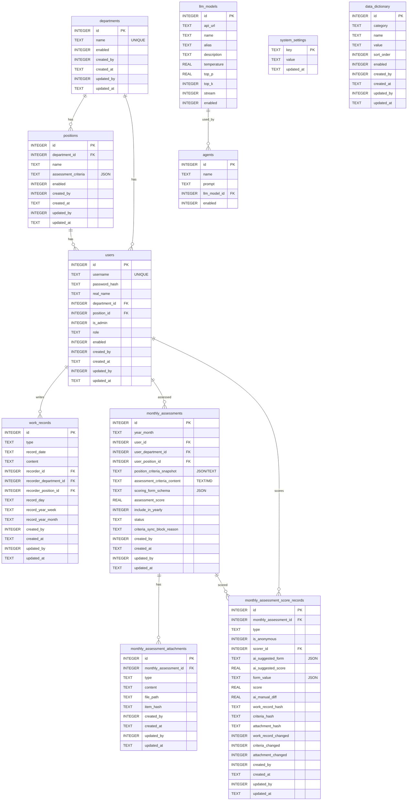

# 宸ヤ綔鑰冩牳骞冲彴 - 瀹屾暣璁捐鏂囨。

闈㈠悜寮€鍙戯細鏋舵瀯銆佹ā鍧椾笌 API 绾﹀畾銆傞儴缃蹭笌鐜鍙橀噺瑙?[DEPLOY.md](DEPLOY.md)銆?
## 涓€銆侀」鐩杩?
### 1.1 鐩爣
鏋勫缓涓€涓敮鎸佹棩鎶?鍛ㄦ姤/鏈堟姤褰曞叆銆丄I 涓庝汉宸ュ弻閫氶亾鑰冩牳銆佹寜閮ㄩ棬/宀椾綅鏍囧噯璇勫垎鐨勬櫤鑳藉伐浣滆瘎鍒嗗钩鍙般€?
### 1.2 鎶€鏈爤
| 灞傜骇 | 鎶€鏈€夊瀷 | 璇存槑 |
|------|----------|------|
| 鍚庣 | **NestJS** (Node.js + TypeScript) | 妯″潡鍖栥€佷緷璧栨敞鍏ャ€佸唴缃畧鍗?绠￠亾 |
| 鍓嶇 | **React + Vite** + Ant Design | Vite 鏋勫缓锛屾敮鎸佹繁鑹?娴呰壊涓婚鍒囨崲 |
| 鏁版嵁搴?| SQLite | 鍗曟枃浠讹紝鏄撻儴缃?|
| 璁よ瘉 | JWT | 鐧诲綍浠ょ墝锛屽彲閰嶇疆杩囨湡鏃堕棿 |
| AI 璇勫垎 | 寮€鏀?API锛堝 OpenAI/鍥戒骇澶фā鍨嬶級 | 寮傛闃熷垪璋冪敤 LLM |

---

## 浜屻€佺郴缁熸灦鏋?
### 2.1 鏁翠綋鏋舵瀯鍥撅紙閫昏緫锛?
```mermaid
flowchart TB
    FE["鍓嶇 Web 搴旂敤<br/>React + Vite + Ant Design"]

    subgraph BE["鍚庣鏈嶅姟 NestJS"]
        API["REST API 鎺у埗鍣?]
        AUTH["璁よ瘉涓庨壌鏉?JWT Guards"]
        CONFIG["绯荤粺閰嶇疆 閮ㄩ棬/宀椾綅/浜哄憳/璁剧疆/瀛楀吀"]
        WORKRECORDS["宸ヤ綔璁板綍 鏃ユ姤/鍛ㄦ姤/鏈堟姤"]
        MONTHLY["鏈堝害鑰冩牳 璁板綍/闄勪欢/璇勫垎"]
        AIASSIST["AI 寤鸿鎵撳垎锛圓gent + LLM锛?]
        SCHED["瀹氭椂浠诲姟 鑷姩鐢熸垚褰撴湀鏈堝害鑰冩牳璁板綍"]
    end

    subgraph DATA["鏁版嵁瀛樺偍 SQLite"]
        DB[(涓氬姟鏁版嵁琛?]
    end

    subgraph AI["LLM 鎻愪緵鏂?]
        LLM["澶фā鍨?API OpenAI/鍥戒骇澶фā鍨?]
    end

    FE --> API
    API --> AUTH
    API --> CONFIG
    API --> WORKRECORDS
    API --> MONTHLY

    CONFIG --> DB
    WORKRECORDS --> DB
    MONTHLY --> DB
    SCHED --> DB
    AIASSIST --> DB

    AIASSIST --> LLM
```

### 2.2 鐩綍缁撴瀯寤鸿

```
WorkScore/
鈹溾攢鈹€ backend/                      # 鍚庣 (NestJS)
鈹?  鈹溾攢鈹€ src/
鈹?  鈹?  鈹溾攢鈹€ app.module.ts
鈹?  鈹?  鈹溾攢鈹€ main.ts
鈹?  鈹?  鈹溾攢鈹€ common/               # 瀹堝崼銆佺閬撱€佽楗板櫒銆佽繃婊ゅ櫒
鈹?  鈹?  鈹溾攢鈹€ config/               # 閰嶇疆妯″潡锛圖B銆丣WT銆丩LM锛?鈹?  鈹?  鈹溾攢鈹€ auth/                 # 璁よ瘉妯″潡锛堢櫥褰曘€佹敼瀵嗐€丣WT 绛栫暐锛?鈹?  鈹?  鈹溾攢鈹€ setup/                # 瀹夎鍚戝锛堥娆″垱寤虹鐞嗗憳锛?鈹?  鈹?  鈹溾攢鈹€ departments/          # 閮ㄩ棬妯″潡
鈹?  鈹?  鈹溾攢鈹€ positions/            # 宀椾綅妯″潡锛堝惈鑰冩牳鏍囧噯锛?鈹?  鈹?  鈹溾攢鈹€ users/                # 浜哄憳妯″潡
鈹?  鈹?  鈹溾攢鈹€ settings/             # 绯荤粺璁剧疆妯″潡
鈹?  鈹?  鈹溾攢鈹€ dictionaries/         # 鏁版嵁瀛楀吀妯″潡
鈹?  鈹?  鈹溾攢鈹€ work-records/         # 宸ヤ綔璁板綍妯″潡
鈹?  鈹?  鈹溾攢鈹€ monthly-assessments/  # 鏈堝害鑰冩牳璁板綍/闄勪欢/璇勫垎妯″潡
鈹?  鈹?  鈹溾攢鈹€ llm-models/           # LLM 妯″瀷妯″潡
鈹?  鈹?  鈹溾攢鈹€ agents/               # Agent 妯″潡
鈹?  鈹?  鈹斺攢鈹€ assessments/          # 鎺掑悕涓庢姤琛ㄦā鍧?鈹?  鈹溾攢鈹€ package.json
鈹?  鈹斺攢鈹€ tsconfig.json
鈹溾攢鈹€ frontend/                     # 鍓嶇 (React + Vite + Ant Design)
鈹?  鈹溾攢鈹€ src/
鈹?  鈹?  鈹溾攢鈹€ api/                  # 璇锋眰灏佽
鈹?  鈹?  鈹溾攢鈹€ components/           # 閫氱敤缁勪欢
鈹?  鈹?  鈹溾攢鈹€ theme/                # 娣辫壊/娴呰壊涓婚閰嶇疆涓庡垏鎹?鈹?  鈹?  鈹溾攢鈹€ layouts/
鈹?  鈹?  鈹溾攢鈹€ pages/                # 鍚畨瑁呭悜瀵奸〉銆佺櫥褰曘€佸悇涓氬姟椤?鈹?  鈹?  鈹溾攢鈹€ stores/
鈹?  鈹?  鈹溾攢鈹€ utils/
鈹?  鈹?  鈹斺攢鈹€ App.tsx
鈹?  鈹溾攢鈹€ package.json
鈹?  鈹斺攢鈹€ vite.config.ts
鈹溾攢鈹€ docs/
鈹?  鈹斺攢鈹€ DESIGN.md
鈹斺攢鈹€ README.md
```

---

## 涓夈€佽〃缁撴瀯

鏈妭涓?*鏁版嵁琛ㄧ粨鏋勪笌涓氬姟绾︽潫**鐨勮璁″熀绾匡紙SQLite 鏂规锛夛紝鐢ㄤ簬鎸囧鍚庣寤鸿〃銆佹牎楠屼笌鍚庡彴浠诲姟瀹炵幇銆?
### 3.1 琛ㄧ粨鏋勮璁″浘锛圗R Diagram锛?


### 3.2 閮ㄩ棬
- 鏁版嵁椤癸細涓婚敭銆佸悕绉般€佹槸鍚﹀惎鐢ㄣ€佸垱寤轰汉銆佸垱寤烘椂闂淬€佹洿鏂颁汉銆佹洿鏂版椂闂淬€?- 绾︽潫锛氬悕绉颁笉鑳介噸澶嶏紱鍚嶇О銆佹槸鍚﹀惎鐢ㄥ繀濉」銆?
### 3.3 宀椾綅
- 鏁版嵁椤癸細涓婚敭銆侀儴闂ㄥ閿€佸悕绉般€佸矖浣嶈€冩牳鏍囧噯銆佹槸鍚﹀惎鐢ㄣ€佸垱寤轰汉銆佸垱寤烘椂闂淬€佹洿鏂颁汉銆佹洿鏂版椂闂淬€?- 绾︽潫锛氬悓涓€閮ㄩ棬宀椾綅鍚嶇О涓嶈兘閲嶅锛涢儴闂ㄥ閿€佸悕绉般€佸矖浣嶈€冩牳鏍囧噯銆佹槸鍚﹀惎鐢ㄥ繀濉」銆?- 涓氬姟瑙勫垯锛氬矖浣嶈€冩牳鏍囧噯鏇存柊鍚庯紝鑷姩鍚屾鍒?*褰撴湀**鏈堝害鑰冩牳璁板綍琛ㄧ殑"宀椾綅鑰冩牳鏍囧噯鍐呭蹇収"瀛楁銆?- 鍚屾闄愬埗锛氬彧瑕佸瓨鍦ㄤ换鎰忎竴鏉?*褰撴湀**鏈堝害鑰冩牳璁板綍鐘舵€佷负"鑰冩牳涓?锛屽垯涓嶅厑璁歌嚜鍔ㄥ悓姝ャ€?- 闃绘柇鍘熷洜锛氬綋鏈堟湀搴﹁€冩牳璁板綍瀛樺湪"鑰冩牳涓?鐘舵€佷笖灏濊瘯淇濆瓨宀椾綅鑰冩牳鏍囧噯鏃讹紝闇€瑕佷繚瀛?鏃犳硶鍦ㄦ湀搴﹁€冩牳涓簲鐢?鐨勫師鍥狅紙寤鸿鍐欏叆鏈堝害鑰冩牳璁板綍鐨?`criteria_sync_block_reason`锛夈€?
### 3.4 浜哄憳
- 鏁版嵁椤癸細涓婚敭銆佺敤鎴峰悕銆佸瘑鐮併€佸鍚嶃€侀儴闂ㄥ閿€佸矖浣嶅閿€佹槸鍚︿负 admin銆佽鑹诧紙榛樿 user锛夈€佹槸鍚﹀惎鐢ㄣ€佸垱寤轰汉銆佸垱寤烘椂闂淬€佹洿鏂颁汉銆佹洿鏂版椂闂淬€?- 绾︽潫锛氱敤鎴峰悕鍏ㄥ眬鍞竴锛涚敤鎴峰悕銆佸瘑鐮併€佸鍚嶃€侀儴闂ㄥ閿€佸矖浣嶅閿€佹槸鍚︿负 admin銆佽鑹层€佹槸鍚﹀惎鐢ㄥ繀濉」銆?- 瑙掕壊锛氭櫘閫氱敤鎴枫€侀儴闂ㄨ礋璐ｄ汉銆佺郴缁熺鐞嗗憳锛堝缓璁灇涓撅細`user` / `department_admin` / `system_admin`锛夈€?
### 3.5 宸ヤ綔璁板綍
- 鏁版嵁椤癸細涓婚敭銆佺被鍨嬶紙鏃ユ姤|鍛ㄦ姤|鏈堟姤锛岄粯璁ゅ懆鎶ワ級銆佹墍灞炴棩鏈燂紙榛樿褰撴棩锛夈€佸唴瀹广€佽褰曚汉銆佽褰曚汉鎵€灞為儴闂ㄥ閿€佽褰曚汉鎵€灞炲矖浣嶅閿€佸垱寤轰汉銆佸垱寤烘椂闂淬€佹洿鏂颁汉銆佹洿鏂版椂闂淬€?- 绾︽潫锛氭瘡浜烘瘡澶╀粎涓€鏉℃棩鎶ャ€佹瘡浜烘瘡鍛ㄤ粎涓€鏉″懆鎶ャ€佹瘡浜烘瘡鏈堜粎涓€鏉℃湀鎶ワ紱绫诲瀷銆佹墍灞炴棩鏈熴€佸唴瀹广€佽褰曚汉蹇呭～椤广€?- 涓氬姟瑙勫垯锛氬綋鏈堝害鑰冩牳璁板綍涓?*闈炲緟鑰冩牳**鐘舵€佹椂锛屼慨鏀瑰伐浣滆褰曠粰浜堟彁绀恒€?- 鍙樻洿鑱斿姩锛氭妸褰撴湀鍛ㄦ姤鍐呭鍋?Hash 璁＄畻锛屾洿鏂板埌瀵瑰簲鐨?鏈堝害鑰冩牳璇勫垎璁板綍琛?鐨?`work_record_hash`锛屽苟鏇存柊"宸ヤ綔璁板綍鏄惁鍙樻洿"瀛楁鍊笺€?
### 3.6 鏈堝害鑰冩牳璁板綍
- 鏁版嵁椤癸細涓婚敭銆佹墍灞炴棩鏈熴€佽€冩牳浜哄閿€佽€冩牳浜烘墍灞為儴闂ㄥ閿€佽€冩牳浜烘墍灞炲矖浣嶅閿€佸矖浣嶈€冩牳鏍囧噯鍐呭蹇収銆佽€冩牳鏍囧噯鍐呭銆佽€冩牳鎵撳垎椤瑰姩鎬佽〃鍗曞唴瀹广€佽€冩牳鍒嗘暟銆佹槸鍚﹁鍏ュ勾搴﹁€冩牳銆佺姸鎬侊紙寰呰€冩牳銆佽€冩牳涓€佸凡鑰冩牳锛夈€佸垱寤轰汉銆佸垱寤烘椂闂淬€佹洿鏂颁汉銆佹洿鏂版椂闂淬€?- 绾︽潫锛氳€冩牳浜轰竴涓湀浠呮湁涓€鏉¤褰曪紱鎵€灞炴棩鏈熴€佽€冩牳浜哄閿€佹槸鍚﹁鍏ュ勾搴﹁€冩牳銆佺姸鎬佷负蹇呭～椤广€?- 鐘舵€佽鏄庯細寰呰€冩牳锛堟病鏈夎€冩牳璇勫垎璁板綍鏃朵负寰呰€冩牳锛夛紱鑰冩牳涓紙鏈夎€冩牳璇勫垎璁板綍鏃惰嚜鍔ㄦ洿鏀逛负鑰冩牳涓級锛涘凡鑰冩牳锛堣繘琛岄〉闈㈡搷浣滀慨鏀癸級銆?- 淇敼鎻愮ず锛氱姸鎬佷负闈炲緟鑰冩牳鐘舵€佷慨鏀规椂缁欎簣鎻愮ず銆?- 鍙樻洿鑱斿姩锛氭湀搴﹁€冩牳璁板綍鐨?鑰冩牳鏍囧噯鍐呭 Hash"鏇存柊鍒板搴旀湀搴﹁€冩牳璇勫垎璁板綍鐨?`criteria_hash`锛屽苟鏇存柊"鑰冩牳鏍囧噯鍐呭鏄惁鍙樻洿"銆?- 鍚庡彴浠诲姟瀹氭椂妫€鏌ワ細鑷姩鍒涘缓浜哄憳鏈堝害鑰冩牳璁板綍锛堜緥濡傛瘡鏈堝垵涓烘墍鏈夊惎鐢ㄤ汉鍛樺垱寤哄綋鏈堣褰曪級銆?
### 3.7 鏈堝害鑰冩牳璁板綍闄勪欢
- 鏁版嵁椤癸細涓婚敭銆佹湀搴﹁€冩牳璁板綍澶栭敭銆佺被鍨嬶紙浠诲姟璁″垝銆佷唬鐮佽褰曘€丅UG 璁板綍銆佹祴璇曠敤渚嬨€佸叾浠栵級銆佸唴瀹广€佹枃浠惰矾寰勩€佸垱寤轰汉銆佸垱寤烘椂闂淬€佹洿鏂颁汉銆佹洿鏂版椂闂淬€?- 绾︽潫锛氭湀搴﹁€冩牳璁板綍澶栭敭銆佺被鍨嬪繀濉」锛涘唴瀹广€佹枃浠惰矾寰勪笉鑳介兘涓虹┖銆?- 淇敼鎻愮ず锛氭湀搴﹁€冩牳璁板綍鐘舵€佷负闈炲緟鑰冩牳鐘舵€佷慨鏀规椂缁欎簣鎻愮ず銆?- 鍙樻洿鑱斿姩锛氭妸褰撴湀闄勪欢鐨勶紙绫诲瀷銆佸唴瀹广€佹枃浠惰矾寰勶級璁＄畻 Hash锛屾洿鏂板埌瀵瑰簲鏈堝害鑰冩牳璇勫垎璁板綍鐨?`attachment_hash`锛屽苟鏇存柊"鏈堝害鑰冩牳璁板綍闄勪欢鏄惁鍙樻洿"銆?
### 3.8 鏈堝害鑰冩牳璇勫垎璁板綍
- 鏁版嵁椤癸細涓婚敭銆佹湀搴﹁€冩牳璁板綍澶栭敭銆佺被鍨嬶紙棰嗗鑰冩牳銆佸悓浜嬭€冩牳锛夈€佹槸鍚﹀尶鍚嶃€佹墦鍒嗕汉銆丄I 寤鸿鑰冩牳鎵撳垎椤瑰姩鎬佽〃鍗曘€丄I 寤鸿鎵撳垎鍒嗘暟銆佽€冩牳鎵撳垎椤瑰姩鎬佽〃鍗曘€佹墦鍒嗗垎鏁般€丄I 鎵撳垎涓庝汉宸ユ墦鍒嗗樊鍊笺€佸伐浣滆褰?Hash銆佹湀搴﹁€冩牳璁板綍鑰冩牳鏍囧噯鍐呭 Hash銆佹湀搴﹁€冩牳璁板綍闄勪欢 Hash銆佸伐浣滆褰曟槸鍚﹀彉鏇淬€佽€冩牳鏍囧噯鍐呭鏄惁鍙樻洿銆佹湀搴﹁€冩牳璁板綍闄勪欢鏄惁鍙樻洿銆佸垱寤轰汉銆佸垱寤烘椂闂淬€佹洿鏂颁汉銆佹洿鏂版椂闂淬€?- 绾︽潫锛氭湀搴﹁€冩牳璁板綍澶栭敭銆佺被鍨嬨€佹槸鍚﹀尶鍚嶃€佹墦鍒嗕汉銆佽€冩牳鎵撳垎椤瑰姩鎬佽〃鍗曘€佹墦鍒嗗垎鏁般€丄I 鎵撳垎涓庝汉宸ユ墦鍒嗗樊鍊笺€佸伐浣滆褰曟槸鍚﹀彉鏇淬€佽€冩牳鏍囧噯鍐呭鏄惁鍙樻洿銆佹湀搴﹁€冩牳璁板綍闄勪欢鏄惁鍙樻洿涓哄繀濉」銆?- 淇敼鎻愮ず锛氭湀搴﹁€冩牳璁板綍鐘舵€佷负宸茶€冩牳鐘舵€佹椂锛屾柊澧炪€佷慨鏀广€佸垹闄ょ粰浜堟彁绀恒€?
### 3.9 LLM 妯″瀷
- 鏁版嵁椤癸細涓婚敭銆丄PI 鍦板潃銆佸悕绉般€佸埆鍚嶃€佹弿杩般€乀emperature銆乀opP銆乀opK銆佹槸鍚︽祦寮忚緭鍑恒€佹槸鍚﹀惎鐢ㄣ€?
### 3.10 Agent
- 鏁版嵁椤癸細涓婚敭銆佸悕绉般€佹彁绀鸿瘝銆丩LM銆佹槸鍚﹀惎鐢ㄣ€?
### 3.11 绯荤粺璁剧疆
- 鏁版嵁椤癸細key銆乿alue銆佹洿鏂版椂闂淬€?- 绾︽潫锛歬ey 鍞竴銆?- 浣跨敤鍦烘櫙锛氫汉鍛橀粯璁よ鑹?user锛涘伐浣滆褰曟柊寤虹被鍨嬮粯璁ゅ懆鎶ワ紱鎵撳垎鏉冮噸鍗犳瘮锛堜笂绾ч瀵笺€佸悓浜嬶級锛涘悓浜嬫墦鍒嗘渶浣庝汉鏁帮紱鏄惁鍘绘帀鏈€楂樺垎/鏈€浣庡垎鍚庣畻鍧囧€硷紱姣忔湀鎵撳垎鎴嚦鏃ユ湡锛涚櫥褰曚护鐗岃繃鏈熸椂闂达紙灏忔椂锛夛紱榛樿浜哄憳瀵嗙爜锛涙湰鏈堝伐浣滃懆鏁般€?- 鏈湀宸ヤ綔鍛ㄦ暟锛氭湰鏈堝垵鑷姩鏇存柊锛屼篃鍙互鎵嬪伐璋冩暣銆?
### 3.12 鏁版嵁瀛楀吀
- 鏁版嵁椤癸細涓婚敭銆佺被鍒€佸悕绉般€佸€笺€侀『搴忋€佹槸鍚﹀惎鐢ㄣ€佸垱寤轰汉銆佸垱寤烘椂闂淬€佹洿鏂颁汉銆佹洿鏂版椂闂淬€?- 浣跨敤鍦烘櫙锛氭湀搴﹁€冩牳璁板綍闄勪欢锛堜换鍔¤鍒掋€佷唬鐮佽褰曘€丅UG 璁板綍銆佹祴璇曠敤渚嬨€佸叾浠栵級銆?
### 3.13 SQLite 寤鸿〃寤鸿锛堢ず渚嬶級

> 璇存槑锛氫互涓嬩负寤鸿寤鸿〃 SQL锛岀敤浜庤惤鍦扮害鏉熶笌绱㈠紩锛涗笟鍔¤鍒欙紙鐘舵€佽仈鍔ㄣ€丠ash 璁＄畻銆佸悓姝ラ樆鏂師鍥犵瓑锛変富瑕佺敱搴旂敤灞傚疄鐜般€?
```sql
CREATE TABLE system_settings (
  key TEXT PRIMARY KEY,
  value TEXT NOT NULL,
  updated_at TEXT
);

CREATE TABLE departments (
  id INTEGER PRIMARY KEY AUTOINCREMENT,
  name TEXT NOT NULL,
  enabled INTEGER NOT NULL DEFAULT 1,
  created_by INTEGER,
  created_at TEXT,
  updated_by INTEGER,
  updated_at TEXT
);
CREATE UNIQUE INDEX idx_departments_name_unique ON departments(name);

CREATE TABLE positions (
  id INTEGER PRIMARY KEY AUTOINCREMENT,
  department_id INTEGER NOT NULL,
  name TEXT NOT NULL,
  assessment_criteria TEXT NOT NULL, -- JSON
  enabled INTEGER NOT NULL DEFAULT 1,
  created_by INTEGER,
  created_at TEXT,
  updated_by INTEGER,
  updated_at TEXT,
  FOREIGN KEY (department_id) REFERENCES departments(id)
);
CREATE UNIQUE INDEX idx_positions_dept_name_unique ON positions(department_id, name);

CREATE TABLE users (
  id INTEGER PRIMARY KEY AUTOINCREMENT,
  username TEXT NOT NULL,
  password_hash TEXT NOT NULL,
  real_name TEXT NOT NULL,
  department_id INTEGER NOT NULL,
  position_id INTEGER NOT NULL,
  is_admin INTEGER NOT NULL DEFAULT 0,
  role TEXT NOT NULL DEFAULT 'user', -- user | department_admin | system_admin
  enabled INTEGER NOT NULL DEFAULT 1,
  created_by INTEGER,
  created_at TEXT,
  updated_by INTEGER,
  updated_at TEXT,
  FOREIGN KEY (department_id) REFERENCES departments(id),
  FOREIGN KEY (position_id) REFERENCES positions(id)
);
CREATE UNIQUE INDEX idx_users_username_unique ON users(username);

CREATE TABLE work_records (
  id INTEGER PRIMARY KEY AUTOINCREMENT,
  type TEXT NOT NULL DEFAULT 'weekly', -- daily | weekly | monthly
  record_date TEXT NOT NULL,           -- YYYY-MM-DD
  content TEXT NOT NULL,
  recorder_id INTEGER NOT NULL,
  recorder_department_id INTEGER NOT NULL,
  recorder_position_id INTEGER NOT NULL,
  record_day TEXT,        -- YYYY-MM-DD (daily)
  record_year_week TEXT,  -- YYYY-WW   (weekly)
  record_year_month TEXT, -- YYYY-MM   (monthly)
  created_by INTEGER,
  created_at TEXT,
  updated_by INTEGER,
  updated_at TEXT,
  FOREIGN KEY (recorder_id) REFERENCES users(id),
  FOREIGN KEY (recorder_department_id) REFERENCES departments(id),
  FOREIGN KEY (recorder_position_id) REFERENCES positions(id)
);
CREATE UNIQUE INDEX idx_work_records_daily_unique
  ON work_records(recorder_id, record_day) WHERE type = 'daily';
CREATE UNIQUE INDEX idx_work_records_weekly_unique
  ON work_records(recorder_id, record_year_week) WHERE type = 'weekly';
CREATE UNIQUE INDEX idx_work_records_monthly_unique
  ON work_records(recorder_id, record_year_month) WHERE type = 'monthly';

CREATE TABLE monthly_assessments (
  id INTEGER PRIMARY KEY AUTOINCREMENT,
  year_month TEXT NOT NULL, -- YYYY-MM
  user_id INTEGER NOT NULL,
  user_department_id INTEGER NOT NULL,
  user_position_id INTEGER NOT NULL,
  position_criteria_snapshot TEXT,
  assessment_criteria_content TEXT,
  scoring_form_schema TEXT,
  assessment_score REAL,
  include_in_yearly INTEGER NOT NULL DEFAULT 1,
  status TEXT NOT NULL DEFAULT 'pending', -- pending | in_progress | done
  criteria_sync_block_reason TEXT,
  created_by INTEGER,
  created_at TEXT,
  updated_by INTEGER,
  updated_at TEXT,
  FOREIGN KEY (user_id) REFERENCES users(id),
  FOREIGN KEY (user_department_id) REFERENCES departments(id),
  FOREIGN KEY (user_position_id) REFERENCES positions(id)
);
CREATE UNIQUE INDEX idx_monthly_assessments_user_month_unique
  ON monthly_assessments(user_id, year_month);

CREATE TABLE monthly_assessment_attachments (
  id INTEGER PRIMARY KEY AUTOINCREMENT,
  monthly_assessment_id INTEGER NOT NULL,
  type TEXT NOT NULL, -- task_plan | code_record | bug_record | test_case | other
  content TEXT,
  file_path TEXT,
  item_hash TEXT,
  created_by INTEGER,
  created_at TEXT,
  updated_by INTEGER,
  updated_at TEXT,
  FOREIGN KEY (monthly_assessment_id) REFERENCES monthly_assessments(id),
  CHECK (
    (content IS NOT NULL AND length(trim(content)) > 0)
    OR (file_path IS NOT NULL AND length(trim(file_path)) > 0)
  )
);
CREATE INDEX idx_monthly_assessment_attachments_ma ON monthly_assessment_attachments(monthly_assessment_id);

CREATE TABLE monthly_assessment_score_records (
  id INTEGER PRIMARY KEY AUTOINCREMENT,
  monthly_assessment_id INTEGER NOT NULL,
  type TEXT NOT NULL, -- leader | peer
  is_anonymous INTEGER NOT NULL DEFAULT 0,
  scorer_id INTEGER NOT NULL,
  ai_suggested_form TEXT,
  ai_suggested_score REAL,
  form_value TEXT NOT NULL,
  score REAL NOT NULL,
  ai_manual_diff REAL NOT NULL,
  work_record_hash TEXT NOT NULL,
  criteria_hash TEXT NOT NULL,
  attachment_hash TEXT NOT NULL,
  work_record_changed INTEGER NOT NULL,
  criteria_changed INTEGER NOT NULL,
  attachment_changed INTEGER NOT NULL,
  created_by INTEGER,
  created_at TEXT,
  updated_by INTEGER,
  updated_at TEXT,
  FOREIGN KEY (monthly_assessment_id) REFERENCES monthly_assessments(id),
  FOREIGN KEY (scorer_id) REFERENCES users(id)
);
CREATE INDEX idx_monthly_assessment_score_records_ma ON monthly_assessment_score_records(monthly_assessment_id);

CREATE TABLE llm_models (
  id INTEGER PRIMARY KEY AUTOINCREMENT,
  api_url TEXT NOT NULL,
  name TEXT NOT NULL,
  alias TEXT,
  description TEXT,
  temperature REAL,
  top_p REAL,
  top_k INTEGER,
  stream INTEGER NOT NULL DEFAULT 0,
  enabled INTEGER NOT NULL DEFAULT 1
);

CREATE TABLE agents (
  id INTEGER PRIMARY KEY AUTOINCREMENT,
  name TEXT NOT NULL,
  prompt TEXT NOT NULL,
  llm_model_id INTEGER NOT NULL,
  enabled INTEGER NOT NULL DEFAULT 1,
  FOREIGN KEY (llm_model_id) REFERENCES llm_models(id)
);

CREATE TABLE data_dictionary (
  id INTEGER PRIMARY KEY AUTOINCREMENT,
  category TEXT NOT NULL,
  name TEXT NOT NULL,
  value TEXT NOT NULL,
  sort_order INTEGER NOT NULL DEFAULT 0,
  enabled INTEGER NOT NULL DEFAULT 1,
  created_by INTEGER,
  created_at TEXT,
  updated_by INTEGER,
  updated_at TEXT
);
CREATE UNIQUE INDEX idx_data_dictionary_category_value_unique
  ON data_dictionary(category, value);
```

---

## 鍥涖€佸悗绔?API 璁捐

### 4.1 瀹夎鍚戝锛堜粎鏈畨瑁呮椂鍙敤锛?- `GET /api/setup/status` 鈥?杩斿洖 `{ installed: boolean }`锛堟棤浠讳綍鐢ㄦ埛鎴栨棤绠＄悊鍛樻椂涓烘湭瀹夎锛夈€?- `POST /api/setup/init` 鈥?鏈畨瑁呮椂璋冪敤锛氬垱寤哄垵濮嬬鐞嗗憳锛坆ody: `username`, `password`, `realName`锛夛紝鍒濆鍖?system_settings锛岃繑鍥炴垚鍔熷悗瑙嗕负宸插畨瑁呫€傚畨瑁呭悗浠呰兘閫氳繃鐧诲綍浣跨敤銆?
### 4.2 璁よ瘉
- `POST /api/auth/login` 鈥?鐧诲綍锛岃繑鍥?JWT锛涜繃鏈熸椂闂翠粠 `system_settings` 璇汇€?- `POST /api/auth/change-password` 鈥?淇敼褰撳墠鐢ㄦ埛瀵嗙爜锛堥渶鏃у瘑鐮侊級銆?- `GET /api/auth/me` 鈥?褰撳墠鐢ㄦ埛淇℃伅锛堝惈閮ㄩ棬銆佸矖浣嶃€佽鑹?role锛歴ystem_admin | department_admin | user锛夈€?
### 4.3 绯荤粺閰嶇疆锛堟寜瑙掕壊鎺у埗锛?- **閮ㄩ棬**锛歚GET` 鎵€鏈夌櫥褰曠敤鎴峰彲璇伙紱`POST/PUT/DELETE` 浠?**绯荤粺绠＄悊鍛?*锛坮ole=system_admin锛夈€?- **宀椾綅**锛歚GET` 鎵€鏈夌櫥褰曠敤鎴峰彲璇伙紱`POST/PUT/DELETE` **绯荤粺绠＄悊鍛?* 鍏ㄩ儴鍙啓锛?*閮ㄩ棬绠＄悊鍛?* 浠呭彲鍐欐湰閮ㄩ棬锛坉epartment_id = 褰撳墠鐢ㄦ埛 departmentId锛変笅鐨勫矖浣嶃€?- **浜哄憳**锛歚GET` 鎵€鏈夌櫥褰曠敤鎴峰彲璇伙紱`POST/PUT/DELETE` **绯荤粺绠＄悊鍛?* 鍏ㄩ儴鍙啓锛?*閮ㄩ棬绠＄悊鍛?* 浠呭彲鍐欐湰閮ㄩ棬涓嬩汉鍛橈紙鍒涘缓鏃堕儴闂ㄥ浐瀹氫负鏈儴闂級銆?- **璁剧疆**锛歚GET`銆乣PUT` 浠?**绯荤粺绠＄悊鍛?* 鍙闂€?- **鏈堝害鑰冩牳**锛堟湀搴﹁€冩牳璁板綍/闄勪欢/璇勫垎璁板綍锛夛細**绯荤粺绠＄悊鍛?* 涓?**閮ㄩ棬璐熻矗浜?* 鍙闂紙鏅€氱敤鎴锋寜涓氬姟绾︽潫浠呮搷浣滀笌鏈汉鐩稿叧鐨勬暟鎹級銆?- **LLM 妯″瀷/Agent**锛氫粎 **绯荤粺绠＄悊鍛?* 鍙淮鎶ゃ€?- **鏁版嵁瀛楀吀**锛氫粎 **绯荤粺绠＄悊鍛?* 鍙淮鎶わ紱鏅€氱敤鎴峰彧璇汇€?
### 4.4 宸ヤ綔璁板綍
- `GET /api/work-records` 鈥?鍒楄〃锛堟敮鎸佹寜绫诲瀷銆佹棩鏈熴€佽褰曚汉绛涢€夛級
- `POST /api/work-records` 鈥?鏂板锛?*鏍￠獙**锛氭棩鎶ュ悓浜哄悓鏃ヤ粎涓€鏉°€佸懆鎶ュ悓浜哄悓鍛ㄤ粎涓€鏉°€佹湀鎶ュ悓浜哄悓鏈堜粎涓€鏉★紙鍛?鏈堢淮搴﹀缓璁浆鎹负鍛ㄩ敭/鏈堜唤閿惤搴撲互渚垮敮涓€绱㈠紩绾︽潫锛夛紝杩濆弽鍒?4xx + 鏄庣‘鎻愮ず銆?- `GET /api/work-records/:id` 鈥?璇︽儏
- `PUT /api/work-records/:id` 鈥?浠呰褰曚汉鍙敼锛堟敼鏃ユ湡鏃朵粛鏍￠獙鍞竴鎬э級
- `DELETE /api/work-records/:id` 鈥?浠呰褰曚汉鍙垹

### 4.5 宸ヤ綔鑰冩牳
浠?鏈堝害鑰冩牳璁板綍"涓轰腑蹇冿紝鍖呭惈锛氳€冩牳鏍囧噯锛堝惈宀椾綅蹇収锛夈€侀檮浠躲€佽瘎鍒嗚褰曪紙棰嗗/鍚屼簨锛夛紝骞舵敮鎸?AI 鐢熸垚寤鸿鎵撳垎椤逛笌寤鸿鍒嗘暟銆?
- `GET /api/monthly-assessments` 鈥?鍒楄〃锛堝弬鏁帮細`yearMonth` 蹇呭～锛涘彲閫?`departmentId`/`userId`/`status`锛?- `GET /api/monthly-assessments/:id` 鈥?璇︽儏锛堝惈宀椾綅鑰冩牳鏍囧噯蹇収銆佽€冩牳鏍囧噯鍐呭銆佸姩鎬佽〃鍗?schema銆佺姸鎬佺瓑锛?- `PUT /api/monthly-assessments/:id` 鈥?淇敼锛堢姸鎬併€佹槸鍚﹁鍏ュ勾搴︺€佽€冩牳鏍囧噯鍐呭銆佸姩鎬佽〃鍗?schema锛涢潪寰呰€冩牳鐘舵€佷慨鏀归渶鎻愮ず锛?- `GET /api/monthly-assessments/:id/attachments` 鈥?闄勪欢鍒楄〃
- `POST /api/monthly-assessments/:id/attachments` 鈥?鏂板闄勪欢锛堟牎楠岋細鍐呭銆佹枃浠惰矾寰勪笉鑳介兘涓虹┖锛涢潪寰呰€冩牳鐘舵€佷慨鏀归渶鎻愮ず锛?- `PUT /api/monthly-assessment-attachments/:id` 鈥?淇敼闄勪欢锛堝悓涓婏級
- `DELETE /api/monthly-assessment-attachments/:id` 鈥?鍒犻櫎闄勪欢锛堝悓涓婏級
- `GET /api/monthly-assessments/:id/score-records` 鈥?璇勫垎璁板綍鍒楄〃
- `POST /api/monthly-assessments/:id/score-records` 鈥?鏂板璇勫垎璁板綍锛堥瀵?鍚屼簨銆佸尶鍚嶃€佸姩鎬佽〃鍗曘€佸垎鏁帮紱鏈堝害鑰冩牳鐘舵€佷负宸茶€冩牳鏃堕渶鎻愮ず锛?- `PUT /api/monthly-assessment-score-records/:id` 鈥?淇敼璇勫垎璁板綍锛堝凡鑰冩牳鏃堕渶鎻愮ず锛?- `DELETE /api/monthly-assessment-score-records/:id` 鈥?鍒犻櫎璇勫垎璁板綍锛堝凡鑰冩牳鏃堕渶鎻愮ず锛?- `POST /api/monthly-assessment-score-records/:id/ai-suggest` 鈥?鐢熸垚 AI 寤鸿锛堝啓鍏?`ai_suggested_form`銆乣ai_suggested_score`锛?
### 4.6 鎺掑悕涓庢姤琛?- `GET /api/assessments/monthly` 鈥?鎸夋湀涓汉鑰冩牳鎺掑悕锛堝弬鏁帮細`yearMonth`锛涘彲閫?`departmentId`銆乣positionId`锛?- `GET /api/assessments/yearly` 鈥?鎸夊勾涓汉鑰冩牳鎺掑悕锛堝弬鏁帮細`year`锛涘彲閫?`departmentId`銆乣positionId`锛涗粎缁熻"鏄惁璁″叆骞村害鑰冩牳"涓烘槸鐨勬暟鎹級
- 杩斿洖缁撴瀯锛歚{ departmentId, departmentName, rankings: [{ userId, userName, score, rank, positionName? }] }`锛沗score` 涓烘湀搴?骞村害姹囨€诲緱鍒嗭紙鐢辨湀搴﹁€冩牳璁板綍涓庤瘎鍒嗚褰曡绠楋級銆?- **棣栭〉鐢?*锛氫紶褰撳墠鐢ㄦ埛鎵€灞?`departmentId` + 褰撳墠鏈?骞达紝鍗?鎵€灞為儴闂ㄨ瘎鍒嗘帓鍚?

### 4.7 LLM 妯″瀷 / Agent / 鏁版嵁瀛楀吀
- `GET/POST /api/llm-models` 鈥?LLM 妯″瀷鍒楄〃涓庢柊澧烇紙浠呯郴缁熺鐞嗗憳锛?- `GET/PUT/DELETE /api/llm-models/:id` 鈥?LLM 妯″瀷璇︽儏銆佷慨鏀广€佸垹闄わ紙浠呯郴缁熺鐞嗗憳锛?- `GET/POST /api/agents` 鈥?Agent 鍒楄〃涓庢柊澧烇紙浠呯郴缁熺鐞嗗憳锛?- `GET/PUT/DELETE /api/agents/:id` 鈥?Agent 璇︽儏銆佷慨鏀广€佸垹闄わ紙浠呯郴缁熺鐞嗗憳锛?- `GET /api/dictionaries` 鈥?鏁版嵁瀛楀吀鍒楄〃锛堟敮鎸佹寜 `category` 绛涢€夛紱鎵€鏈夌櫥褰曠敤鎴峰彧璇伙級
- `POST /api/dictionaries` 鈥?鏂板瀛楀吀椤癸紙浠呯郴缁熺鐞嗗憳锛?- `PUT /api/dictionaries/:id` 鈥?淇敼瀛楀吀椤癸紙浠呯郴缁熺鐞嗗憳锛?- `DELETE /api/dictionaries/:id` 鈥?鍒犻櫎瀛楀吀椤癸紙浠呯郴缁熺鐞嗗憳锛?
### 4.8 鏉冮檺绾﹀畾
- 瀹夎鎺ュ彛锛氫粎褰?`GET /api/setup/status` 涓烘湭瀹夎鏃跺彲璋冪敤 `POST /api/setup/init`锛涘凡瀹夎鍚庝笉鍐嶆毚闇叉垨杩斿洖 403銆?- 鍏朵綑 API锛堥櫎鐧诲綍銆佸畨瑁咃級闇€ JWT銆?- **瑙掕壊**锛歚system_admin`锛堢郴缁熺鐞嗗憳锛夈€乣department_admin`锛堥儴闂ㄧ鐞嗗憳锛夈€乣user`锛堟櫘閫氱敤鎴凤級銆傞儴闂ㄧ鐞嗗憳浠呭彲缁存姢鏈儴闂紙department_id = 褰撳墠鐢ㄦ埛 departmentId锛変笅鐨勫矖浣嶄笌浜哄憳锛涚郴缁熻缃€佽€冩牳闃熷垪銆丄I 鑰冩牳娴嬭瘯浠呯郴缁熺鐞嗗憳涓庨儴闂ㄧ鐞嗗憳鍙闂紙绯荤粺璁剧疆浠呯郴缁熺鐞嗗憳锛夈€?- 閮ㄩ棬鍐欐搷浣滐細浠?`role = 'system_admin'`銆傚矖浣?浜哄憳鍐欐搷浣滐細绯荤粺绠＄悊鍛樻棤闄愬埗锛岄儴闂ㄧ鐞嗗憳浠呴檺鏈儴闂ㄨ祫婧愩€?- 宸ヤ綔璁板綍淇敼/鍒犻櫎锛氫粎 `recorder_id = 褰撳墠鐢ㄦ埛`銆?- 璇勫垎璁板綍鍒犻櫎锛氫粎 `scorer_id = 褰撳墠鐢ㄦ埛`銆?
---

## 浜斻€佸墠绔ā鍧楄璁?
### 5.1 涓婚锛堟繁鑹?/ 娴呰壊 / 璺熼殢绯荤粺锛?- 浣跨敤 **Ant Design 5** 鐨?ConfigProvider + 涓婚鍙橀噺锛堝 `token.colorBgContainer`銆乣token.colorText`锛夛紝閰嶅悎 CSS 鍙橀噺鎴?theme 鍖呯淮鎶や袱濂?token銆?- 涓婚鍋忓ソ瀛樺叆鏈湴瀛樺偍锛堝 `localStorage.theme = 'light' | 'dark' | 'system'`锛夛紝鍚姩鏃惰鍙栧苟搴旂敤锛涙彁渚涘叏灞€鍒囨崲鍏ュ彛锛堝椤舵爮鍥炬爣/涓嬫媺锛夛紝鏀寔娴呰壊銆佹繁鑹层€佽窡闅忕郴缁熶笁绉嶉€夐」銆?- 娣辫壊涓婚锛歚algorithm: theme.darkAlgorithm`锛涙祬鑹诧細`algorithm: theme.defaultAlgorithm`銆備繚璇佸垪琛ㄣ€佽〃鍗曘€佸脊绐楀湪涓ょ涓婚涓嬪潎鍙銆?
### 5.2 璺敱涓庨〉闈?- `/setup` 鈥?**瀹夎鍚戝**锛氫粎鍦ㄦ湭瀹夎鏃跺彲璁块棶锛涜〃鍗曡緭鍏ョ鐞嗗憳璐﹀彿銆佸瘑鐮併€佸鍚嶏紝鎻愪氦鍚庤皟鐢?`POST /api/setup/init`锛屾垚鍔熷悗璺宠浆鐧诲綍銆傝嫢宸插畨瑁呭垯閲嶅畾鍚戝埌 `/login` 鎴?`/`銆?- `/login` 鈥?鐧诲綍
- **`/`锛堥椤碉級** 鈥?**鎵€灞為儴闂ㄨ瘎鍒嗘帓鍚?*锛氬睍绀哄綋鍓嶇敤鎴锋墍鍦ㄩ儴闂ㄧ殑褰撴湀锛堟垨鍙€夋湀/骞达級鎺掑悕锛屽惈鍛ㄦ姤寰楀垎涓庢€诲垎锛涢粯璁ゅ嵆閮ㄩ棬鎺掑悕椤碉紝鏃犻渶鍐嶈烦杞€?- `/work-records` 鈥?宸ヤ綔璁板綍鍒楄〃锛堢瓫閫夈€佹柊寤恒€佺紪杈戙€佸垹闄わ級锛涙柊寤烘椂鍓嶇鍙彁绀?姣忎汉姣忓ぉ浠呬竴鏉℃棩鎶ャ€佹瘡浜烘瘡鍛ㄤ粎涓€鏉″懆鎶ャ€佹瘡浜烘瘡鏈堜粎涓€鏉℃湀鎶?銆?- `/work-records/:id` 鈥?璁板綍璇︽儏 + 璇勫垎鍒楄〃锛堜竴鏉?AI + 澶氭潯浜哄伐锛屽睍绀鸿瘎鍒嗚鏄庯紱**璇勫垎浜哄彲鍒犺嚜宸辩殑璇勫垎**锛? 浜哄伐璇勫垎鍏ュ彛锛堣嫢褰撳墠鐢ㄦ埛宸茶瘎杩囧垯闅愯棌锛夛紱浜哄伐璇勫垎琛ㄥ崟鍚?*鎬诲垎**涓?*璇勫垎璇存槑锛堝潎蹇呭～锛?*锛屾牴鎹?criteria 鍔ㄦ€佺敓鎴愯瘎鍒嗛」銆?- `/assessments` 鈥?鑰冩牳涓庢帓鍚嶏紙Tab锛氭湀搴︽帓鍚?/ 骞村害鎺掑悕锛屽彲鍒囨崲閮ㄩ棬銆佹湀/骞达紱琛ㄦ牸鍚懆鎶ュ緱鍒嗐€佹€诲垎锛?- **`/score-queue`** 鈥?**鑰冩牳闃熷垪鏌ョ湅**锛氬垪琛ㄥ睍绀哄緟澶勭悊/澶勭悊涓?宸插畬鎴?澶辫触锛屽彲绛涚姸鎬併€佹椂闂达紱鏀寔璺宠浆瀵瑰簲宸ヤ綔璁板綍璇︽儏銆?- `/system` 鈥?绯荤粺閰嶇疆锛堜粎绠＄悊鍛樺彲瑙佹垨鍙紪杈戯級
  - `/system/departments` 鈥?閮ㄩ棬 CRUD
  - `/system/positions` 鈥?**宀椾綅 CRUD**锛堝綊灞為儴闂ㄣ€佽€冩牳鏍囧噯 JSON 缂栬緫锛?  - `/system/users` 鈥?浜哄憳 CRUD锛堝惈宀椾綅閫夋嫨锛夈€佷慨鏀瑰瘑鐮佸叆鍙?  - `/system/llm-models` 鈥?LLM 妯″瀷绠＄悊锛堜粎绯荤粺绠＄悊鍛橈級
  - `/system/agents` 鈥?Agent 绠＄悊锛堜粎绯荤粺绠＄悊鍛橈級
  - `/system/dictionaries` 鈥?鏁版嵁瀛楀吀绠＄悊锛堜粎绯荤粺绠＄悊鍛橈級
  - `/system/ai-test` 鈥?AI 鑰冩牳娴嬭瘯锛堜粎绯荤粺/閮ㄩ棬绠＄悊鍛橈級
  - `/system/settings` 鈥?浠ょ墝杩囨湡鏃堕棿绛夎缃紙浠呯郴缁熺鐞嗗憳锛?- `/profile` 鈥?涓汉淇℃伅锛沗/change-password` 鈥?淇敼褰撳墠鐢ㄦ埛瀵嗙爜

### 5.3 鐘舵€佷笌鏉冮檺
- 鍏ㄥ眬锛氬綋鍓嶇敤鎴蜂俊鎭紙鍚?departmentId銆?*role**锛夈€乼oken銆?*涓婚妯″紡**锛涜矾鐢卞畧鍗細鏈櫥褰曡烦杞櫥褰曪紱鏈畨瑁呭彲鏀捐 `/setup`锛屽凡瀹夎璁块棶 `/setup` 鍒欓噸瀹氬悜銆傛寜 role 鎺у埗鑿滃崟涓庨〉闈細鏅鸿兘鑰冩牳闃熷垪銆丄I鑰冩牳娴嬭瘯浠?system_admin/department_admin锛涚郴缁熻缃粎 system_admin锛涘矖浣?浜哄憳缂栬緫锛氶儴闂ㄧ鐞嗗憳浠呮湰閮ㄩ棬銆?- 绯荤粺閰嶇疆鍐欐搷浣滐細閮ㄩ棬浠呯郴缁熺鐞嗗憳锛涘矖浣?浜哄憳鎸夎鑹蹭笌閮ㄩ棬鏍￠獙銆?- 宸ヤ綔璁板綍鍒楄〃锛氫粎璁板綍浜烘樉绀?缂栬緫/鍒犻櫎"銆?- 璇勫垎鍒楄〃锛氫粎**璇勫垎浜烘湰浜?*瀵规瘡鏉¤瘎鍒嗘樉绀?鍒犻櫎"锛涜嫢宸插瓨鍦ㄥ悓绫诲瀷璇勫垎鍒欎汉宸ヨ瘎鍒嗘寜閽殣钘忔垨绂佺敤銆?
### 5.4 鍏抽敭缁勪欢
- **棣栭〉锛堟墍灞為儴闂ㄦ帓鍚嶏級**锛氬彇褰撳墠鐢ㄦ埛 departmentId锛岃姹傚綋鏈堬紙鎴栧彲閫夋湀/骞达級閮ㄩ棬鎺掑悕锛岃〃鏍煎睍绀哄悕娆°€佸鍚嶃€佸垎鏁帮紱鍙揩鎹峰垏鎹㈡湀浠?骞村害銆?- **瀹夎鍚戝椤?*锛氬崟椤佃〃鍗曪紙绠＄悊鍛樿处鍙枫€佸瘑鐮併€佸鍚嶏級锛屾彁浜ゅ墠鏍￠獙锛岄敊璇彁绀哄弸濂姐€?- 宸ヤ綔璁板綍琛ㄥ崟锛氱被鍨嬶紙鏃ユ姤/鍛ㄦ姤/鏈堟姤锛夈€佹墍灞炴棩鏈燂紙鍛ㄦ姤鍙€夊懆涓€鏃ユ湡鎴栨棩鏈熼€夋嫨鍣ㄨ嚜鍔ㄨ浆鍛ㄤ竴锛夈€丮arkdown 缂栬緫鍣ㄣ€?- 宀椾綅琛ㄥ崟锛氶儴闂ㄩ€夋嫨銆佸矖浣嶅悕绉般€佽€冩牳鏍囧噯锛堝彲 JSON 缂栬緫鎴栫粨鏋勫寲琛ㄥ崟椤瑰垪琛級銆?- 鑰冩牳鏍囧噯灞曠ず锛氫粠宀椾綅鎺ュ彛/璁板綍浜哄矖浣嶈鍙栵紝浜哄伐璇勫垎琛ㄥ崟鎸夐」鎵撳垎锛屽苟鍚?*鎬诲垎**涓?*璇勫垎璇存槑锛堝潎蹇呭～锛?*銆?- 璇勫垎鍒楄〃锛氬睍绀?AI/浜哄伐銆佹€诲垎銆?*璇勫垎璇存槑**銆佽瘎鍒嗕汉銆佹椂闂达紱浠呰瘎鍒嗕汉鏄剧ず鍒犻櫎鎸夐挳銆?- **鑰冩牳闃熷垪椤?*锛氳〃鏍煎垪濡傚伐浣滆褰曟憳瑕併€佺被鍨嬨€佽褰曚汉銆佺姸鎬侊紙pending/processing/done/failed锛夈€佸叆闃熸椂闂淬€佸鐞嗗畬鎴愭椂闂淬€侀敊璇俊鎭紱鏀寔鎸夌姸鎬佺瓫閫夈€佸垎椤碉紱琛屽彲鐐瑰嚮杩涘叆宸ヤ綔璁板綍璇︽儏銆?- 鎺掑悕琛ㄦ牸锛欰nt Design Table锛屾敮鎸佹寜閮ㄩ棬銆佹湀浠?骞翠唤绛涢€夛紱鏍峰紡闅忎富棰樺垏鎹€?
---

## 鍏€佹牳蹇冧笟鍔℃祦绋?
### 6.1 杞欢瀹夎锛堥娆★級
1. 閮ㄧ讲鍚庤闂墠绔紝鑻?`GET /api/setup/status` 杩斿洖 `installed: false`锛屽垯灞曠ず瀹夎鍚戝椤碉紙濡?`/setup`锛夈€?2. 鐢ㄦ埛杈撳叆绠＄悊鍛樿处鍙枫€佸瘑鐮併€佸鍚嶏紝鎻愪氦 `POST /api/setup/init`銆?3. 鍚庣鍒涘缓棣栨潯鐢ㄦ埛锛坕s_admin=1锛宺ole=system_admin锛夛紝鍐欏叆 system_settings 榛樿鍊硷紙濡?token 杩囨湡鏃堕棿锛夛紝杩斿洖鎴愬姛銆?4. 鍓嶇璺宠浆鐧诲綍椤碉紱姝ゅ悗 `GET /api/setup/status` 杩斿洖 `installed: true`锛屽畨瑁呮帴鍙ｄ笉鍐嶅彲鐢ㄣ€?
### 6.2 鎻愪氦宸ヤ綔璁板綍骞惰仈鍔ㄦ湀搴﹁€冩牳
1. 鐢ㄦ埛鎻愪氦宸ヤ綔璁板綍 鈫?`POST /api/work-records`銆傚悗绔?*鏍￠獙鍞竴鎬?*锛氭棩鎶ュ悓浜哄悓鏃ヤ粎涓€鏉°€佸懆鎶ュ悓浜哄悓鍛ㄤ粎涓€鏉°€佹湀鎶ュ悓浜哄悓鏈堜粎涓€鏉★紙鍛?鏈堢淮搴﹀缓璁惤搴撲负 `record_year_week`/`record_year_month` 渚夸簬鍞竴绱㈠紩绾︽潫锛夛紝杩濆弽鍒?400 + 鎻愮ず銆?2. 鍐欏叆 `work_records`锛堝惈"璁板綍浜烘墍灞為儴闂?宀椾綅澶栭敭"蹇収瀛楁锛夈€傝嫢璇ョ敤鎴峰綋鏈堟湀搴﹁€冩牳璁板綍鐘舵€佷负**闈炲緟鑰冩牳**锛屼慨鏀?淇濆瓨宸ヤ綔璁板綍闇€瑕佺粰浜堟彁绀猴紙鍓嶇鍙簩娆＄‘璁わ級銆?3. 璁＄畻褰撴湀鍛ㄦ姤鍐呭 Hash锛堝缓璁寜褰撴湀鎵€鏈夊懆鎶ユ寜鏃ユ湡鎺掑簭鎷兼帴鍚?Hash锛夛紝鏇存柊鍒板搴?`monthly_assessment_score_records.work_record_hash`锛屽苟灏?`work_record_changed` 缃负 1銆?
### 6.3 棰嗗/鍚屼簨璇勫垎涓?AI 寤鸿
1. 鍚庡彴瀹氭椂浠诲姟鍦ㄦ瘡鏈堝垵涓烘墍鏈夊惎鐢ㄤ汉鍛樺垱寤哄綋鏈?`monthly_assessments`锛堢姸鎬佷负寰呰€冩牳锛夛紝骞跺啓鍏ュ矖浣嶈€冩牳鏍囧噯蹇収銆?2. 璇勫垎浜鸿繘鍏ユ湀搴﹁€冩牳椤甸潰锛岄€夋嫨鏌愮敤鎴峰綋鏈?`monthly_assessments`锛屾彁浜ら瀵?鍚屼簨璇勫垎 鈫?`POST /api/monthly-assessments/:id/score-records`锛屽啓鍏?`monthly_assessment_score_records`锛涘綋鍑虹幇棣栨潯璇勫垎璁板綍鏃讹紝灏嗘湀搴﹁€冩牳璁板綍鐘舵€佽嚜鍔ㄧ疆涓?鑰冩牳涓?銆?3. 鍙璇勫垎璁板綍瑙﹀彂 AI 寤鸿 鈫?`POST /api/monthly-assessment-score-records/:id/ai-suggest`锛岀敱 Agent + LLM 鐢熸垚寤鸿鎵撳垎椤瑰姩鎬佽〃鍗曚笌寤鸿鍒嗘暟锛屽啓鍏?`ai_suggested_form`銆乣ai_suggested_score`銆?4. 鏈堝害鑰冩牳璁板綍鐘舵€佷负"宸茶€冩牳"鏃讹紝瀵硅瘎鍒嗚褰曠殑鏂板/淇敼/鍒犻櫎闇€瑕佺粰浜堟彁绀恒€?
### 6.4 姹囨€昏绠椾笌鏈堝害/骞村害鎺掑悕
- **鏈堝害寰楀垎**锛氭寜绯荤粺璁剧疆鐨勬潈閲嶈鍒欙紙涓婄骇棰嗗/鍚屼簨鏉冮噸銆佸悓浜嬫渶浣庝汉鏁般€佹槸鍚﹀墧闄ゆ渶楂?鏈€浣庡悗姹傚潎鍊肩瓑锛夎仛鍚?`monthly_assessment_score_records`锛屽緱鍒?`monthly_assessments.assessment_score`锛堜篃鍙惤搴撴垨鎸夐渶璁＄畻锛夈€?- **鏈堝害鐘舵€?*锛氭棤璇勫垎璁板綍鏃朵负"寰呰€冩牳"锛涘瓨鍦ㄨ瘎鍒嗚褰曟椂鑷姩涓?鑰冩牳涓?锛?宸茶€冩牳"涓洪〉闈㈡搷浣滅‘璁ゅ悗鐨勭粓鎬併€?- **骞村害寰楀垎**锛氳仛鍚堝綋骞村悇鏈堟湀搴﹁€冩牳璁板綍锛堜粎缁熻"鏄惁璁″叆骞村害鑰冩牳"涓烘槸锛夛紝寰楀埌骞村害姹囨€诲垎銆?- **鎺掑悕**锛氭寜閮ㄩ棬/宀椾綅/鏈堜唤锛堟垨骞翠唤锛夌淮搴﹁繘琛屾帓搴忓苟杩斿洖姒滃崟銆?
---

## 涓冦€侀厤缃笌閮ㄧ讲瑕佺偣

- **瀹夎**锛氶娆￠儴缃插悗閫氳繃瀹夎鍚戝鍒涘缓绠＄悊鍛樿处鍙蜂笌瀵嗙爜锛屼箣鍚庝粎鑳介€氳繃鐧诲綍浣跨敤绯荤粺銆?- **鐜鍙橀噺**锛氭暟鎹簱璺緞銆丣WT 瀵嗛挜銆丩LM API Key 鍙?endpoint銆侺LM 鐩稿叧锛堝惈 temperature銆乼op_p锛変篃鍙湪绯荤粺璁剧疆涓厤缃紝浼樺厛浠ョ郴缁熻缃负鍑嗐€?- **绯荤粺璁剧疆閿?*锛坄system_settings`锛夛細濡?`token_expire_hours`銆乣default_user_password`銆乣default_user_role`锛堥粯璁?user锛夈€乣work_record_default_type`锛堥粯璁?weekly锛夈€乣leader_weight_percent` / `peer_weight_percent`銆乣peer_min_count`銆乣peer_drop_high_low`锛堟槸鍚﹀墧闄ゆ渶楂?鏈€浣庡垎鍚庢眰鍧囧€硷級銆乣scoring_deadline_day`锛堟瘡鏈堟墦鍒嗘埅鑷虫棩鏈燂級銆乣work_weeks_in_month`锛屼互鍙?LLM 鐩稿叧鐨?`llm_api_url` / `llm_api_key` / `llm_model` / `llm_temperature` / `llm_top_p` / `llm_top_k` / `llm_stream` 绛夈€?- **SQLite**锛氬崟鏂囦欢锛屾敞鎰忓苟鍙戝啓锛堝彲鑰冭檻 WAL 妯″紡锛夈€?- **AI 寤鸿鎵撳垎**锛氭寜 Agent 鎻愮ず璇?+ 宀椾綅鑰冩牳鏍囧噯/宸ヤ綔璁板綍/闄勪欢鐢熸垚寤鸿鎵撳垎椤逛笌寤鸿鍒嗘暟锛涙敮鎸侀噸璇曚笌澶辫触璁板綍銆?- **鏉冮檺**锛氭寜鐢ㄦ埛瑙掕壊锛坰ystem_admin / department_admin / user锛夋帶鍒讹細閮ㄩ棬 CRUD 浠呯郴缁熺鐞嗗憳锛涘矖浣?浜哄憳/瀛楀吀鍐欐搷浣滅郴缁熺鐞嗗憳鍏ㄩ儴銆侀儴闂ㄨ礋璐ｄ汉浠呮湰閮ㄩ棬锛涚郴缁熻缃笌 LLM 妯″瀷/Agent 浠呯郴缁熺鐞嗗憳锛涙湀搴﹁€冩牳璁板綍/璇勫垎鎸変笟鍔＄害鏉熸帶鍒惰闂寖鍥淬€傚伐浣滆褰曞啓鎺ュ彛鏍￠獙 `recorder_id`锛涙湀搴﹁€冩牳璇勫垎鍐欐帴鍙ｆ牎楠?`scorer_id`锛涘畨瑁呮帴鍙ｄ粎鏈畨瑁呮椂鍙敤銆?- **璇勫垎**锛氭湀搴﹁€冩牳鏀寔棰嗗/鍚屼簨璇勫垎涓庡尶鍚嶏紱鍚屼簨璇勫垎浜烘暟涓庢槸鍚﹀墧闄ゆ渶楂?鏈€浣庡垎绛夎鍒欑敱绯荤粺璁剧疆鎺у埗锛涙湀搴︾姸鎬佷负"宸茶€冩牳"鏃惰瘎鍒嗘柊澧?淇敼/鍒犻櫎闇€鎻愮ず銆?
浠ヤ笂涓哄畬鏁磋璁℃枃妗ｏ紝鍙寜妯″潡杩唬寮€鍙戯紱鑰冩牳鏍囧噯浠ュ矖浣嶄负鍗曚綅缁存姢锛屾棩鎶?鍛ㄦ姤/鏈堟姤涓庤瘎鍒嗗敮涓€鎬х敱鍚庣涓ユ牸鏍￠獙锛屼富棰樹笌瀹夎娴佺▼宸茬撼鍏ヨ璁°€?

---

## 闄勫綍锛氳瘎鍒嗗紓甯搞€佺己澶变笌 AI 澶辫触绛栫暐

### 1. system_settings 鏂板閰嶇疆椤癸紙瀛楁瀹氫箟/榛樿鍊?鏍￠獙锛?
#### 1.1 缂哄け澶勭悊绛栫暐锛堣嚜璇?/ 鍛ㄦ姤锛?
| Key | Type | Default | Desc | Validate |
|---|---|---:|---|---|
| missing_self_review_policy | enum(deduct\|reweight) | reweight | 鑷瘎缂哄け澶勭悊绛栫暐 | 蹇呭～ |
| missing_weekly_report_policy | enum(deduct\|reweight) | deduct | 鍛ㄦ姤缂哄け澶勭悊绛栫暐 | 蹇呭～ |
| missing_deduct_points | int | 5 | policy=deduct 鏃舵墸鍒嗗€?| 0~20锛沺olicy=deduct 蹇呭～ |
| missing_reweight_min_participants | int | 3 | policy=reweight 鏃舵渶灏忓弬涓庝汉鏁伴棬妲?| 1~20 |

**璁＄畻瑙勫垯寤鸿锛?*
- policy=deduct锛氬搴旀潵婧愮己澶辨椂锛岀洿鎺ヤ粠鎬诲垎鎵?`missing_deduct_points`锛堟墸鍒版渶浣?0锛夈€?- policy=reweight锛氬皢缂哄け鏉ユ簮鏉冮噸缃?0锛屽鍓╀綑鏉ユ簮鏉冮噸鎸夋瘮渚嬪綊涓€鍖栵紙浣嗛渶婊¤冻 `missing_reweight_min_participants`锛屽惁鍒欏洖閫€涓?deduct 鎴栨爣璁扳€滀笉鍙眹鎬烩€濓紝鐢辩鐞嗗憳澶勭悊锛夈€?
#### 1.2 AI 寤鸿鍒嗗け璐ョ瓥鐣?
| Key | Type | Default | Desc | Validate |
|---|---|---:|---|---|
| ai_failure_policy | enum(retry_then_manual\|exclude_from_calc) | retry_then_manual | AI 澶辫触鐨勫叏灞€绛栫暐 | 蹇呭～ |
| ai_max_retries | int | 3 | AI 璇锋眰鏈€澶ч噸璇曟鏁?| 0~10锛涜嫢 policy=retry_then_manual 寤鸿 鈮? |
| ai_retry_backoff_ms | int | 5000 | 閲嶈瘯閫€閬挎椂闂?| 0~600000 |
| ai_schema_validation | bool | true | 鏄惁寮哄埗缁撴瀯鍖栬緭鍑烘牎楠岋紙JSON Schema锛?| 蹇呭～ |
| ai_default_llm_model | string | (required) | 榛樿妯″瀷 key/model_id | 蹇呭～锛涢渶瀛樺湪浜?llm_models |
| ai_default_agent | string | (required) | 榛樿 Agent key | 蹇呭～锛涢渶瀛樺湪浜?agents |

**澶辫触鍒ゅ畾锛?*
- 璇锋眰瓒呮椂 / HTTP 闈?2xx / 杩斿洖涓嶅彲瑙ｆ瀽 JSON / schema 鏍￠獙澶辫触 鈫?璁颁负澶辫触锛涙寜绛栫暐澶勭悊銆?- policy=exclude_from_calc锛氳鏉¤褰曠殑 AI 鏉ユ簮瑙嗕负缂哄け锛堣繘鍏ョ己澶辩瓥鐣ヨ矾寰勶級锛屼笖蹇呴』鍦ㄦ眹鎬绘姤鍛婃樉寮忔爣娉ㄢ€淎I 澶辫触鏈弬涓庘€濄€?
#### 1.3 寮傝绐楀彛涓庡彂甯冩帶鍒?
| Key | Type | Default | Desc | Validate |
|---|---|---:|---|---|
| appeal_window_days | int | 3 | 寮傝绐楀彛澶╂暟 | 0~30 |
| appeal_open_from | enum(month_end\|score_published) | score_published | 寮傝绐楀彛璧风畻鐐?| 蹇呭～ |
| appeal_after_close_editable | bool | false | 绐楀彛鍏抽棴鍚庢槸鍚﹀厑璁哥鐞嗗憳淇敼鍒嗘暟 | 蹇呭～ |

**鎺ㄨ崘绾︽潫锛?*
- `appeal_window_days=0` 琛ㄧず涓嶅紑鏀惧紓璁紱鐘舵€佺洿鎺ヨ繘鍏?finalized銆?- `appeal_after_close_editable=false` 鏃讹紝finalized 鍚庣姝㈡敼鍒嗭紙鍙兘璧扳€滄洿姝ｅ崟/瀹¤杩藉姞鈥濓級銆?
---

## 闄勫綍锛氭湀搴﹁€冩牳鐘舵€佹満锛圓ssessment Lifecycle锛?
寤鸿灏嗘湀搴﹁€冩牳鐢熷懡鍛ㄦ湡缁熶竴涓猴細

`draft -> submitted -> published -> appeal_open -> appeal_closed -> finalized`

**鐘舵€佸惈涔変笌鍐欐搷浣滅害鏉燂細**
- draft锛氬彲缂栬緫璇勫垎銆佸彲鎾ら攢锛涗粎鏈汉/涓婄骇閾捐矾鍙锛堟寜鏉冮檺锛?- submitted锛氭彁浜ゅ悗鍙厑璁糕€滃彂璧峰紓璁?琛ュ厖鏉愭枡鈥濓紙涓嶆敼鍒嗭級
- published锛氬彂甯冪粰鐩稿叧浜哄憳鏌ョ湅锛涜Е鍙?`appeal_open_from=score_published` 鏃惰繘鍏?appeal_open
- appeal_open锛氬厑璁告彁寮傝/涓婁紶璇佹嵁锛涚鐞嗗憳鍙鐞嗗紓璁紙鎸夋潈闄愶級
- appeal_closed锛氬紓璁湡缁撴潫锛涗粎鍏佽鐢熸垚褰掓。鎶ュ憡
- finalized锛氬綊妗ｉ攣瀹氾紱涓嶅厑璁告敼鍒嗭紙闄ら潪 `appeal_after_close_editable=true`锛?
> 濡傛灉鐜版湁琛ㄥ瓧娈典粛涓?`pending/in_progress/done`锛岄渶鍦ㄦ枃妗ｄ腑琛ュ厖涓庝笂杩扮姸鎬佺殑鏄犲皠鍏崇郴锛岄伩鍏嶅疄鐜版涔夈€?
---

## 闄勫綍锛氭潈閲嶆牎楠屼笌淇濆瓨瑙勫垯

鏉冮噸瀛楁娌跨敤锛?`weight_self_review / weight_peer_review / weight_leader_review / weight_ai_suggest`

**寮烘牎楠岋細**
- 淇濆瓨鍓嶅繀椤绘弧瓒筹細`sum(weights) == 100`
- 浠讳竴鏉冮噸鑼冨洿锛?~100
- UI 寤鸿鑳藉姏锛氫竴閿綊涓€鍖栵紙鎸夋瘮渚嬬缉鏀惧埌 100锛? 鑷姩琛ラ綈锛堟渶鍚庝竴椤瑰惛鏀跺樊鍊硷級

---

## 闄勫綍锛氭柊澧為〉闈笌鏉冮檺锛堜笌鍘熷瀷瀵归綈锛?
### 鍓嶇璺敱琛ラ綈
- `/login` 鐧诲綍椤?- `/setup` 瀹夎鍚戝锛堜粎鏈畨瑁呭彲璁块棶锛?- `/score-queue` 鑰冩牳闃熷垪
- `/system/ai-test` AI 鑰冩牳娴嬭瘯
- `/system/llm-models` LLM 妯″瀷绠＄悊
- `/system/agents` Agent 绠＄悊
- `/system/dictionaries` 鏁版嵁瀛楀吀

### 鏉冮檺鐭╅樀锛堟柊澧為」锛?
| Page / Action | system_admin | department_admin | employee |
|---|---:|---:|---:|
| /login, /change-password, /profile | 鉁?| 鉁?| 鉁?|
| /setup | 鉁咃紙浠呮湭瀹夎锛?| 鉂?| 鉂?|
| /score-queue锛堟煡鐪?閲嶈瘯/浜哄伐鍏滃簳锛?| 鉁?| 鉁咃紙浠呮湰閮ㄩ棬锛?| 鉂?|
| /system/ai-test锛堣繍琛屾祴璇?淇濆瓨鐢ㄤ緥锛?| 鉁?| 鉁?| 鉂?|
| /system/llm-models锛圕RUD/璁鹃粯璁わ級 | 鉁?| 鉂?| 鉂?|
| /system/agents锛圕RUD/璁鹃粯璁わ級 | 鉁?| 鉂?| 鉂?|
| /system/dictionaries锛圕RUD锛?| 鉁?| 鉂?| 鉂?|

---

## 闄勫綍锛氶槦鍒椾换鍔℃ā鍨嬶紙鏀拺 /score-queue锛?
寤鸿鏂板浠诲姟鍩熸ā鍨嬶紙鍙嫭绔嬭〃锛夛細`score_queue`

瀛楁寤鸿锛?- id锛堜换鍔D锛?- task_type锛歚ai_suggest_score | recalc_summary | manual_fallback`
- status锛歚pending | running | failed | done`
- retries / max_retries
- last_error / error_code
- payload_ref锛堝紩鐢?work_record / assessment / user锛?- created_at / updated_at

**澶勭悊瑙勫垯锛?*
- AI 寤鸿鍒嗙敓鎴愬け璐?鈫?鍏ラ槦锛坅i_suggest_score锛?- `ai_failure_policy=retry_then_manual` 涓旈噸璇曡€楀敖 鈫?status=failed锛屽厑璁歌Е鍙?manual_fallback


